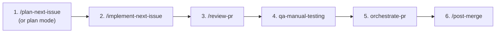

[](https://github.com/theta-ai-tech/gsm-api/actions/workflows/ci.yml)

# gsm-api

FastAPI service for **GameSetMatch (GSM)** — a social sports matchmaking app for tennis, padel,
and pickleball. Firestore for data, Cloud Functions for triggers, Firebase Auth for identity,
containerized and deployed via Cloud Run, CI on PRs.

📚 **All documentation lives under [`docs/`](docs/README.md)** — start at the index, which routes
you by audience (client/iOS, backend, operations). This README is just the repo front page:
quickstart, the agent workflow, and `make` targets.

---

## Quickstart (local, no Docker)

```bash
make venv
make install
make api-dev
# open http://localhost:8000/health
# interactive docs: http://localhost:8000/docs
```

For the emulator-backed setup, auth testing, and Docker, see
[`docs/development/local-setup.md`](docs/development/local-setup.md).

---

## Working with agents

Development is driven by Claude Code **skills** (slash commands that define the *workflow*) and
**agents** (personas that define the *perspective*). A skill is what you type; an agent is who does
the work. The pipeline runs one issue from sprint board to merge:



| # | Step | Skill | Agent / persona | What happens |
|---|------|-------|-----------------|--------------|
| 1 | **Plan** | `/plan-next-issue` (or plan mode) | research/planning | Picks the next sprint issue, creates the branch + worktree, and writes an implementation plan as the handoff artifact. |
| 2 | **Implement** | `/implement-next-issue` | `gsm-backend-developer` | Implements the plan, runs tests, commits, opens the PR, and generates the smoke script. |
| 3 | **Review** | `/review-pr` | `gsm-code-reviewer` | Adversarial diff review (correctness, regressions, security, Firestore cost, coverage). Posts inline + summary comments as `iggy-theta-tech`. |
| 4 | **QA** | qa-manual-testing | `gsm-qa-tester` | Runs manual/smoke testing against the emulator and posts a QA verdict. |
| 5 | **Orchestrate PR** | orchestrate-pr | — | Reconciles review + QA feedback, drives fixes, and gets the PR merge-ready. |
| 6 | **Post-merge** | `/post-merge` | (inline) | Updates `.agent/SPRINT.md` after merge. |

> Sprint utilities run inline: `/plan-sprint`, `/standup`, `/pre-merge-checks`, `/smoke-test <pr>`.
> Steps 4–5 (`qa-manual-testing`, `orchestrate-pr`) are part of the working flow but are not yet
> captured as skills under `.claude/skills/`. The legacy `/autopilot` cron loop is deprecated and
> no longer part of the standard flow.

### Consult-only specialist

| Agent | When to invoke |
|-------|----------------|
| `gsm-tpm` | Backend architectural review, gap analysis vs existing models/triggers/collections, data-model design for a new feature — *before* writing code. |

```text
# e.g. delegate an architectural read before any code changes
ask gsm-tpm whether adding a global "player_ranking" collection fits our existing model,
or whether we should extend the play state instead
```

---

## Make targets

```bash
# Environment
make venv                 # create virtualenv
make install              # install API deps (editable)

# Run
make api-dev              # run FastAPI locally (no emulator)
make api-dev-emu          # run against the Firestore emulator
make api-dev-emu-auth     # run against Firestore + Auth emulators
make api-dev-real         # run against real Firestore (requires ADC)
make emu-firestore        # start Firestore emulator
make emu-all              # start Firestore + Auth emulators
make seed-emu             # seed the emulator with GSM sample data

# Quality
make fmt format type      # ruff lint/autofix + format + mypy (run after every change)
make test                 # all tests (requires emulators)
make test-unit            # unit tests (no emulator)
make test-int             # integration tests (requires emulators)
make docs-check           # validate internal doc links/anchors

# Docker
make docker-build         # build dev image (docker-build-amd64 for Apple Silicon)
make docker-run           # run locally on http://127.0.0.1:8080
```

The full target list lives in `ops/Makefile`.

---

## Documentation

Everything is under [`docs/`](docs/README.md) — the index routes by audience. Highlights:

- **Calling the API (iOS/clients):** [`docs/api/README.md`](docs/api/README.md) → [`ios-integration.md`](docs/api/ios-integration.md), [`endpoints.md`](docs/api/endpoints.md), [`contracts.md`](docs/api/contracts.md), [`play-tab-state-machine.md`](docs/api/play-tab-state-machine.md)
- **Architecture:** [`overview.md`](docs/architecture/overview.md), [`diagrams.md`](docs/architecture/diagrams.md), [`security.md`](docs/architecture/security.md) (auth/AuthZ/CORS), [`triggers.md`](docs/architecture/triggers.md), [`match-lifecycle.md`](docs/architecture/match-lifecycle.md)
- **Data model:** [`data-dictionary.md`](docs/data/data-dictionary.md) (canonical), [`models.md`](docs/data/models.md), [`queries-and-indexes.md`](docs/data/queries-and-indexes.md)
- **Operations:** [`runbook.md`](docs/operations/runbook.md), [`deployment.md`](docs/operations/deployment.md) (functions deploy/rollback/smoke), [`observability.md`](docs/operations/observability.md) (health, readiness, telemetry), [`credentials.md`](docs/operations/credentials.md), [`tools.md`](docs/operations/tools.md) (seed, cache rebuild/integrity, journal backfill)
- **Development:** [`local-setup.md`](docs/development/local-setup.md) (emulator, Docker, auth testing), [`testing.md`](docs/development/testing.md)
