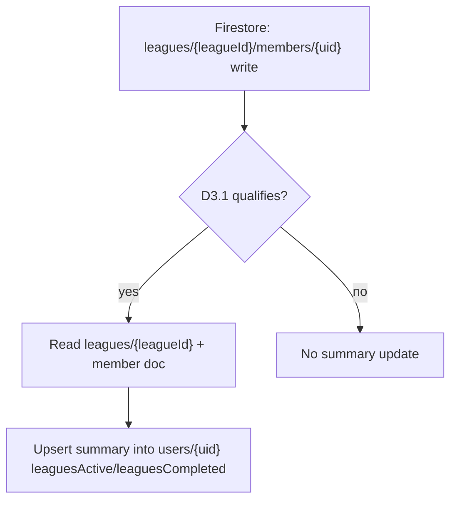

# League Member Triggers

## onLeagueMemberWrite upsert flow

```mermaid
flowchart TD
    A["Firestore: leagues/{leagueId}/members/{uid} write"] --> B{D3.1 qualifies?}
    B -->|yes| C["Read leagues/{leagueId} + member doc"]
    C --> D["Upsert summary into users/{uid} leaguesActive/leaguesCompleted"]
    B -->|no| E["No summary update"]
```
