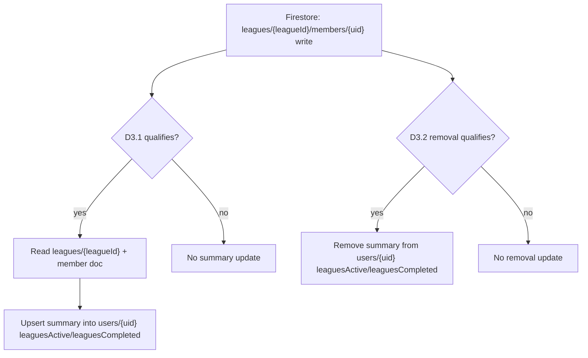

# League Member Triggers

## onLeagueMemberWrite upsert/removal flow

```mermaid
flowchart TD
    A["Firestore: leagues/{leagueId}/members/{uid} write"] --> B{D3.1 qualifies?}
    B -->|yes| C["Read leagues/{leagueId} + member doc"]
    C --> D["Upsert summary into users/{uid} leaguesActive/leaguesCompleted"]
    B -->|no| E["No summary update"]
    A --> F{D3.2 removal qualifies?}
    F -->|yes| G["Remove summary from users/{uid} leaguesActive/leaguesCompleted"]
    F -->|no| H["No removal update"]
```
