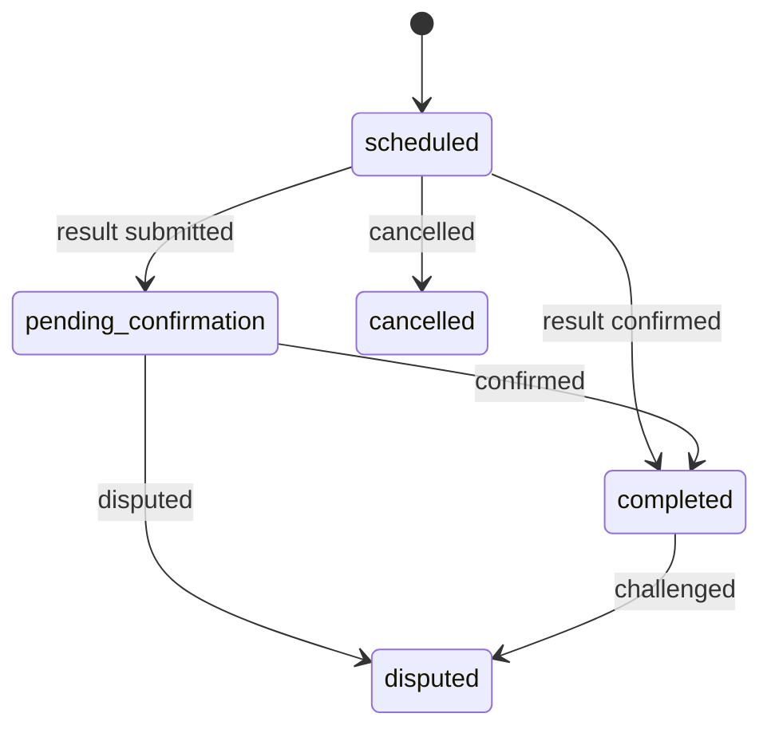
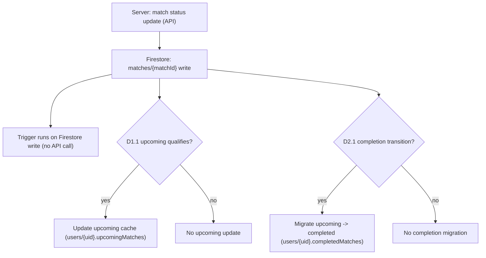

# Match Lifecycle & Triggers

## Match status lifecycle

```mermaid
stateDiagram-v2
    [*] --> scheduled
    scheduled --> pending_confirmation: result submitted
    scheduled --> completed: result confirmed
    scheduled --> cancelled: cancelled
    pending_confirmation --> completed: confirmed
    pending_confirmation --> disputed: disputed
    completed --> disputed: challenged
```

## onMatchWrite trigger flow

```mermaid
flowchart TD
    H["Server: match status update (API)"] --> A["Firestore: matches/{matchId} write"]
    A --> I["Trigger runs on Firestore write (no API call)"]
    A --> B{D1.1 upcoming qualifies?}
    B -->|yes| C["Update upcoming cache (users/{uid}.upcomingMatches)"]
    B -->|no| D["No upcoming update"]
    A --> E{D2.1 completion transition?}
    E -->|yes| F["Migrate upcoming -> completed (users/{uid}.completedMatches)"]
    E -->|no| G["No completion migration"]
```
