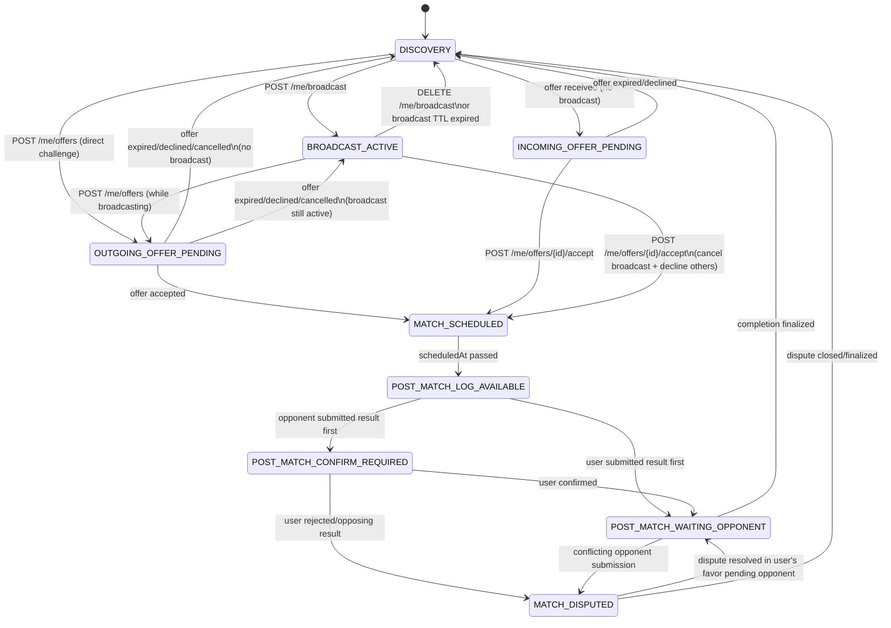

# Tab 1 State Machine (/me/state)

## Core state diagram

## Offer queue behavior

When a user is in `BROADCAST_ACTIVE`, incoming offers **do not change the state**. Instead they accumulate in `playTab.pendingIncomingOfferIds` on the user doc. The `/me/state` payload includes the list of pending offers so the UI can display a chooser.

Accepting any offer from BROADCAST_ACTIVE transitions directly to MATCH_SCHEDULED, which also:
- Cancels the active broadcast (status → `matched`)
- Declines all other pending offers (status → `declined`)
- Clears `playTab.pendingIncomingOfferIds`

## Time-based transitions

These transitions cannot be driven by Firestore triggers alone (no "cron" on doc fields). They are handled by **freshness reconciliation** on GET /me/state:

| Stale state | Condition | Corrected state |
|---|---|---|
| `BROADCAST_ACTIVE` | `broadcast.expiresAt < now` | → `DISCOVERY` |
| `OUTGOING_OFFER_PENDING` | `offer.expiresAt < now` | → `DISCOVERY` or `BROADCAST_ACTIVE` |
| `INCOMING_OFFER_PENDING` | `offer.expiresAt < now` | → `DISCOVERY` |
| `MATCH_SCHEDULED` | `match.scheduledAt < now` | → `POST_MATCH_LOG_AVAILABLE` |

The API reads the persisted `playTab.state`, checks the relevant timestamps, and corrects + writes back if stale. This ensures the client always sees accurate state.
