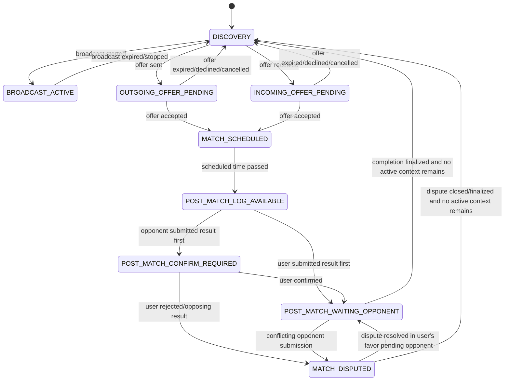

# Tab 1 State Machine (/me/state)

```mermaid
stateDiagram-v2
    [*] --> DISCOVERY

    DISCOVERY --> BROADCAST_ACTIVE: broadcast started
    BROADCAST_ACTIVE --> DISCOVERY: broadcast expired/stopped

    DISCOVERY --> OUTGOING_OFFER_PENDING: offer sent
    OUTGOING_OFFER_PENDING --> DISCOVERY: offer expired/declined/cancelled

    DISCOVERY --> INCOMING_OFFER_PENDING: offer received
    INCOMING_OFFER_PENDING --> DISCOVERY: offer expired/declined/cancelled

    OUTGOING_OFFER_PENDING --> MATCH_SCHEDULED: offer accepted
    INCOMING_OFFER_PENDING --> MATCH_SCHEDULED: offer accepted

    MATCH_SCHEDULED --> POST_MATCH_LOG_AVAILABLE: scheduled time passed
    POST_MATCH_LOG_AVAILABLE --> POST_MATCH_WAITING_OPPONENT: user submitted result first
    POST_MATCH_LOG_AVAILABLE --> POST_MATCH_CONFIRM_REQUIRED: opponent submitted result first

    POST_MATCH_CONFIRM_REQUIRED --> POST_MATCH_WAITING_OPPONENT: user confirmed
    POST_MATCH_CONFIRM_REQUIRED --> MATCH_DISPUTED: user rejected/opposing result
    POST_MATCH_WAITING_OPPONENT --> MATCH_DISPUTED: conflicting opponent submission

    MATCH_DISPUTED --> POST_MATCH_WAITING_OPPONENT: dispute resolved in user's favor pending opponent
    MATCH_DISPUTED --> DISCOVERY: dispute closed/finalized and no active context remains
    POST_MATCH_WAITING_OPPONENT --> DISCOVERY: completion finalized and no active context remains
```
