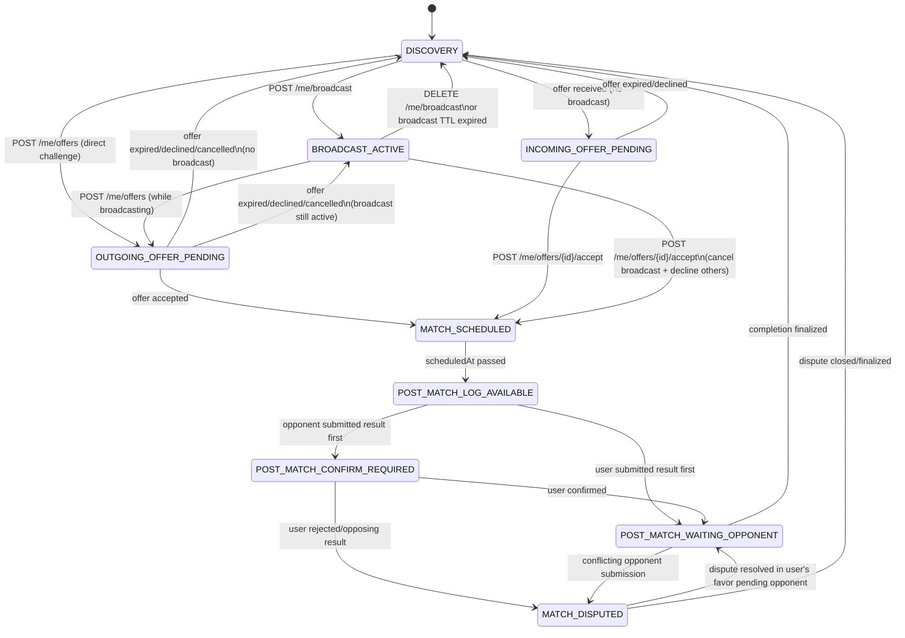

# Tab 1 State Machine (/me/state)

## Core state diagram

## Offer queue behavior

When a user is in `BROADCAST_ACTIVE`, incoming offers **do not change the state**. Instead they accumulate in `playTab.pendingIncomingOfferIds` on the user doc. The `/me/state` payload includes the list of pending offers so the UI can display a chooser.

Accepting any offer from BROADCAST_ACTIVE transitions directly to MATCH_SCHEDULED, which also:
- Cancels the active broadcast (status → `matched`)
- Declines all other pending offers (status → `declined`)
- Clears `playTab.pendingIncomingOfferIds`

## Time-based transitions

These transitions cannot be driven by Firestore triggers alone (no "cron" on doc fields). They are handled by **freshness reconciliation** on GET /me/state:

| Stale state | Condition | Corrected state |
|---|---|---|
| `BROADCAST_ACTIVE` | `broadcast.expiresAt < now` | → `DISCOVERY` |
| `OUTGOING_OFFER_PENDING` | `offer.expiresAt < now` | → `DISCOVERY` or `BROADCAST_ACTIVE` |
| `INCOMING_OFFER_PENDING` | `offer.expiresAt < now` | → `DISCOVERY` |
| `MATCH_SCHEDULED` | `match.scheduledAt < now` | → `POST_MATCH_LOG_AVAILABLE` |

The API reads the persisted `playTab.state`, checks the relevant timestamps, and corrects + writes back if stale. This ensures the client always sees accurate state.

## Implementation: Repository Operations per Transition

This table shows which repositories and operations are involved in each state transition for developers implementing the business logic.

| Transition | Endpoint | Repository Operations |
|------------|----------|----------------------|
| DISCOVERY → BROADCAST_ACTIVE | `POST /me/broadcast` | • BroadcastsRepo.create() • UsersRepo.update_play_tab(state=BROADCAST_ACTIVE, activeBroadcastId=...) |
| BROADCAST_ACTIVE → DISCOVERY (manual) | `DELETE /me/broadcast` | • BroadcastsRepo.update_status(cancelled) • OffersRepo.batch_update_status(declined) for all pending • UsersRepo.update_play_tab(state=DISCOVERY, clear fields) |
| BROADCAST_ACTIVE → DISCOVERY (expired) | `GET /me/state` (freshness) | • BroadcastsRepo.update_status(expired) • UsersRepo.update_play_tab(state=DISCOVERY) |
| DISCOVERY → OUTGOING_OFFER_PENDING | `POST /me/offers` (direct) | • OffersRepo.create() • UsersRepo.update_play_tab(sender: state=OUTGOING_OFFER_PENDING, activeOutgoingOfferId=...) • UsersRepo.update_play_tab(recipient: state=INCOMING_OFFER_PENDING, append to pendingIncomingOfferIds) |
| BROADCAST_ACTIVE → OUTGOING_OFFER_PENDING | `POST /me/offers` (while broadcasting) | • OffersRepo.create() • UsersRepo.update_play_tab(sender: state=OUTGOING_OFFER_PENDING, keep activeBroadcastId) • UsersRepo.update_play_tab(recipient: append to pendingIncomingOfferIds, state unchanged if BROADCAST_ACTIVE) |
| OUTGOING_OFFER_PENDING → DISCOVERY | offer expired/declined/cancelled | • OffersRepo.update_status() • UsersRepo.update_play_tab(sender: state=DISCOVERY) • UsersRepo.update_play_tab(recipient: remove from pendingIncomingOfferIds, recalc state) |
| OUTGOING_OFFER_PENDING → BROADCAST_ACTIVE | offer resolved, broadcast still active | • OffersRepo.update_status() • UsersRepo.update_play_tab(sender: state=BROADCAST_ACTIVE, clear activeOutgoingOfferId) • UsersRepo.update_play_tab(recipient: remove from pendingIncomingOfferIds) |
| INCOMING_OFFER_PENDING → DISCOVERY | `POST /me/offers/{id}/decline` | • OffersRepo.update_status(declined) • UsersRepo.update_play_tab(recipient: state=DISCOVERY, clear pendingIncomingOfferIds) • UsersRepo.update_play_tab(sender: recalc state) |
| INCOMING_OFFER_PENDING → MATCH_SCHEDULED | `POST /me/offers/{id}/accept` | • OffersRepo.update_status(accepted, matchId=...) • MatchesRepo.create() • BroadcastsRepo.update_status(matched) if recipient had broadcast • OffersRepo.batch_update_status(declined) for all other pending • UsersRepo.update_play_tab(both users: state=MATCH_SCHEDULED, activeMatchId=..., clear broadcast/offer fields) |
| BROADCAST_ACTIVE → MATCH_SCHEDULED | `POST /me/offers/{id}/accept` (from queue) | • OffersRepo.update_status(accepted, matchId=...) • MatchesRepo.create() • BroadcastsRepo.update_status(matched) • OffersRepo.batch_update_status(declined) for all other pending • UsersRepo.update_play_tab(both users: state=MATCH_SCHEDULED, clear all fields) |
| OUTGOING_OFFER_PENDING → MATCH_SCHEDULED | opponent accepts | • OffersRepo.update_status(accepted, matchId=...) • MatchesRepo.create() • UsersRepo.update_play_tab(both users: state=MATCH_SCHEDULED) |
| MATCH_SCHEDULED → POST_MATCH_LOG_AVAILABLE | `GET /me/state` (freshness) | • MatchesRepo.get() to check scheduledAt • UsersRepo.update_play_tab(state=POST_MATCH_LOG_AVAILABLE) |

**Notes**:
- All write operations within a single endpoint call use **Firestore transactions** to ensure atomic multi-document updates
- `batch_update_status()` refers to updating multiple offer docs in a single transaction (e.g., declining all pending offers when accepting one)
- "recalc state" means checking if user has active broadcast → BROADCAST_ACTIVE, else → DISCOVERY
