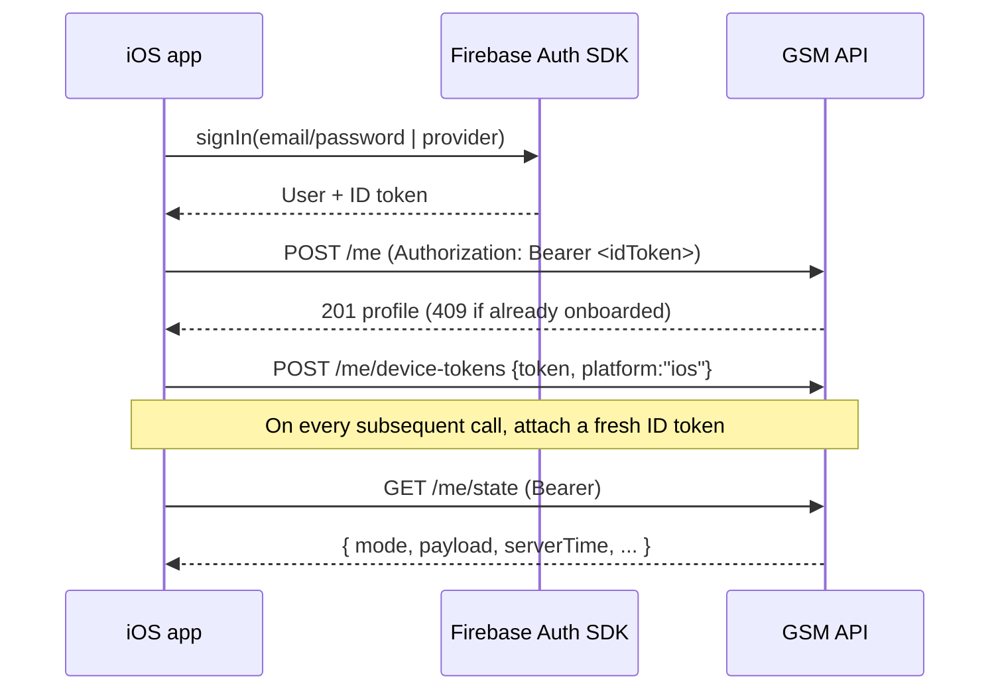

# iOS Integration Guide

How the iOS client integrates with the GSM API — auth lifecycle, the screen→endpoint map, polling
vs push, and worked call examples. Pairs with [`README.md`](README.md) (conventions, error model)
and the full [`endpoints.md`](endpoints.md) reference.

> **For the iOS team / iOS code agent:** the "Screen → API" table and the "Client call notes"
> sections below are meant to be filled in and kept current from the client side — note which
> SwiftUI screen calls which endpoint, what it sends, and how it maps the response. The backend
> owns the contract; this doc owns the *binding* between client screens and that contract.

## Auth lifecycle



Rules of thumb:
- **Always attach a current ID token.** Let the Firebase SDK refresh it; don't cache a token past
  its expiry. A `401` means fetch a fresh token and retry once.
- **Onboard once.** `POST /me` is idempotency-guarded — a `409` just means the profile already
  exists; treat it as success and proceed.
- **Register the FCM token after sign-in** and whenever it rotates; unregister on sign-out
  (`DELETE /me/device-tokens`).

## Screen → API map

The app is four tabs. This is the canonical binding of screens to endpoints (prefixes resolve
against the base URL in [`README.md`](README.md)).

| Tab / screen | Primary endpoint(s) | Notes |
|---|---|---|
| **Onboarding** | `POST /me` | First-run profile + preferences. 409 = already onboarded. |
| **Tab 1 — Play (home)** | `GET /me/state` | UI router: render one screen per `mode`. Poll while foregrounded. |
| Play — discovery list/map | `GET /me/discovery` | Challengeable players / broadcasts nearby. |
| Play — go available | `POST /me/broadcast` / `DELETE /me/broadcast` | Create/cancel an availability broadcast. |
| Play — offers | `POST /me/offers`, `…/{id}/accept`, `…/{id}/decline`, `…/{id}/cancel` | Drives the offer queue. |
| Post-match — submit/confirm score | `POST /matches/{id}/verify-score` | Score submit/confirm; can move match to `disputed`. |
| **Tab 2 — Improve** | `GET/POST/PATCH/DELETE /me/journal`, `GET /me/journal/{id}` | Journal CRUD. |
| Improve — stats / north star | `GET /me/stats`, `PUT /me/north-star` | Player stats & goal. |
| **Tab 3 — Lab** | `GET /me/lab/{progression,dashboard,skill-dna,leaderboard,ticker,training-plan}` | Analytics surfaces. |
| Lab — opponent insight | `GET /me/lab/rivalry/{opponentUid}`, `GET /me/lab/scouting/{opponentUid}` | Head-to-head / scouting. |
| **Tab 4 — Clubhouse** | `GET /me/clubhouse/profile` | Public-facing profile. |
| Leagues | `GET /leagues`, `/leagues/{id}`, `/leagues/{id}/standings`, `/leagues/{id}/matches` | Browse & detail. |
| Venues / court picker | `GET /venues`, `GET /venues/search` | Court selection for broadcasts/offers. |
| Push registration | `POST /me/device-tokens`, `DELETE /me/device-tokens` | FCM token lifecycle. |

Exact request/response bodies are in [`endpoints.md`](endpoints.md); frozen shapes for the
broadcast/offer/match create flows are in [`contracts.md`](contracts.md).

## Driving the Play tab

`GET /me/state` returns a stable envelope (`mode`, `primary`, `payload`, `annotations`, `uiEvents`)
and is the **only** thing the home tab needs to decide what to show. The client should:

1. Switch on `mode` to choose the screen (see the mode table in
   [`play-tab-state-machine.md`](play-tab-state-machine.md)).
2. Use `serverTime` for all countdowns/expiry (offer/broadcast TTLs), not the device clock.
3. Surface `uiEvents` (e.g. `offer_expired`, `offer_declined`) as transient toasts/banners.
4. Re-fetch after any state-changing action (broadcast/offer/score) — the server reconciles stale
   time-based state on read, so a fresh `GET /me/state` is always authoritative.

## Polling vs push

- **Foreground:** poll `GET /me/state` while the Play tab is visible (e.g. a modest interval, and
  immediately after any user action). The endpoint is cheap (mostly a single denormalized user-doc
  read) and self-correcting.
- **Background / cross-screen:** rely on **push** (FCM). The backend delivers notifications
  server-side when relevant play-state transitions occur (incoming offer, offer accepted, score to
  confirm, etc.). The `data` payload carries `type` plus the relevant id (`offerId` / `matchId` /
  `broadcastId`) so the client can deep-link and then refresh `GET /me/state`. See
  [`notifications.md`](notifications.md).
- The client never polls Firestore directly and never translates intents itself — delivery is
  backend-owned.

## Worked example — go available, then get matched

```bash
TOKEN="<firebase id token>"
BASE="http://localhost:8000"

# 1. Render the home tab
curl -s "$BASE/me/state" -H "Authorization: Bearer $TOKEN"

# 2. Go available (create a broadcast) — see contracts.md for the exact body
curl -s -X POST "$BASE/me/broadcast" \
  -H "Authorization: Bearer $TOKEN" -H "Content-Type: application/json" \
  -d '{ "sport": "padel", "availability": "today", "court_status": "have_court", "venue_ref": { ... } }'

# 3. Home tab now returns mode BROADCAST_ACTIVE; incoming offers appear in payload
curl -s "$BASE/me/state" -H "Authorization: Bearer $TOKEN"

# 4. Accept an offer → match scheduled
curl -s -X POST "$BASE/me/offers/<offerId>/accept" -H "Authorization: Bearer $TOKEN"

# 5. After play, submit the score
curl -s -X POST "$BASE/matches/<matchId>/verify-score" \
  -H "Authorization: Bearer $TOKEN" -H "Content-Type: application/json" \
  -d '{ ... }'
```

## Client call notes

> _iOS team: record client-side specifics here — Swift networking layer, token-refresh wrapper,
> retry/backoff policy, JSON decoding strategy (key casing), and any per-endpoint quirks discovered
> in integration. Keep it next to the contract so backend changes and client bindings stay in sync._
