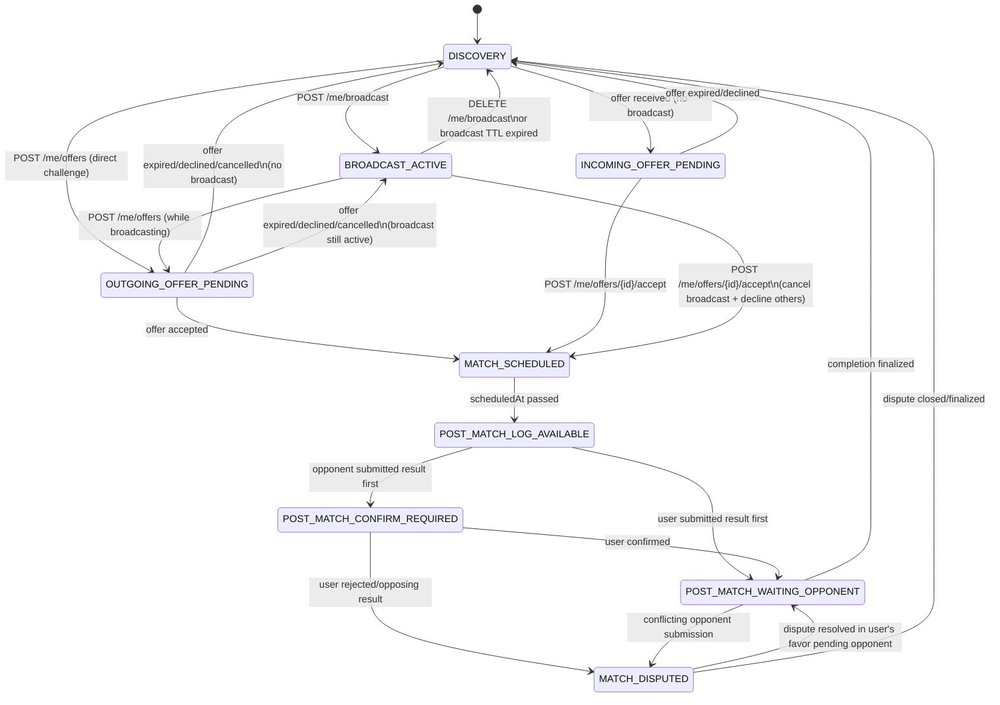

# Play Tab State Machine (`GET /me/state`)

> **Canonical contract for the Tab-1 UI router.** This is the single source of truth
> for the `/me/state` mode enum, the response envelope, and the transition rules.
> Client payload examples per mode live in [`../api/contracts.md`](contracts.md).

`GET /me/state` returns the current *mode* the Play tab should render, plus a mode-specific
payload. The client renders one screen per mode and never has to compute state itself.

## Modes (`PlayTabStateEnum`)

| Mode | Intent |
|---|---|
| `DISCOVERY` | Default browse state; map + challengeable player list. |
| `BROADCAST_ACTIVE` | User has an active availability broadcast. Incoming offers queue up and are included in the payload. |
| `OUTGOING_OFFER_PENDING` | User sent an offer and is waiting for a response before expiry. |
| `INCOMING_OFFER_PENDING` | User received an offer (no active broadcast) and must respond before expiry. |
| `MATCH_SCHEDULED` | A confirmed upcoming match is the primary focus. |
| `POST_MATCH_LOG_AVAILABLE` | Match time passed; user can submit/log the result. |
| `POST_MATCH_WAITING_OPPONENT` | User logged a result and is waiting for the opponent. |
| `POST_MATCH_CONFIRM_REQUIRED` | Opponent logged a result; this user must confirm/reject. |
| `MATCH_DISPUTED` | Conflicting post-match submissions requiring the dispute-resolution flow. |

## Response envelope

Every call to `GET /me/state` returns this stable shape. The `payload` contents vary by mode.

```json
{
  "mode": "<PlayTabStateEnum>",
  "serverTime": "2026-02-03T10:00:00Z",
  "primary": {
    "broadcastId": "<string | null>",
    "matchId": "<string | null>",
    "activeOfferIds": ["<offerId>"]
  },
  "payload": { },
  "annotations": { },
  "uiEvents": []
}
```

| Field | Type | Description |
|---|---|---|
| `mode` | string | Current `PlayTabStateEnum` value. |
| `serverTime` | ISO 8601 UTC | Server timestamp; the client should use this for countdown/expiry calculations. |
| `primary.broadcastId` | string / null | Active broadcast doc ID (set in `BROADCAST_ACTIVE`). |
| `primary.matchId` | string / null | Active match doc ID (set from `MATCH_SCHEDULED` through post-match states). |
| `primary.activeOfferIds` | array\<string> | IDs of offers relevant to the current state (pending incoming or outgoing). |
| `payload` | object | Mode-specific data. See [`contracts.md`](contracts.md) for full examples per mode. |
| `annotations` | object | Discovery-only UI hints (e.g. pinned card, nearby count). Empty for non-discovery modes. |
| `uiEvents` | array\<object> | Transient notices about events since last poll (e.g. offer expired). Not modes. |

### `uiEvents` shape

```json
{
  "type": "offer_expired",
  "message": "Offer from Sam expired.",
  "meta": { "offerId": "o_1" }
}
```

Known event types: `offer_expired`, `offer_declined`, `broadcast_expired`, `match_completed`.

## State diagram



## Offer queue behavior

When a user is in `BROADCAST_ACTIVE`, incoming offers **do not change the state**. They accumulate
in `playTab.pendingIncomingOfferIds` on the user doc, and the `/me/state` payload includes the list
so the UI can show a chooser.

Accepting any offer from `BROADCAST_ACTIVE` transitions directly to `MATCH_SCHEDULED`, which also:
- Cancels the active broadcast (status → `matched`)
- Declines all other pending offers (status → `declined`)
- Clears `playTab.pendingIncomingOfferIds`

## Freshness reconciliation (time-based transitions)

Time-based transitions (broadcast/offer expiry, match `scheduledAt`) cannot be driven by Firestore
triggers alone. They are corrected on read: `GET /me/state` reads the persisted `playTab.state`
(the fast path), checks the relevant timestamps, and corrects + writes back if stale. The client
therefore always sees an accurate state regardless of whether background jobs have run.

| Stale state | Condition | Corrected state |
|---|---|---|
| `BROADCAST_ACTIVE` | `broadcast.expiresAt < now` | → `DISCOVERY` |
| `OUTGOING_OFFER_PENDING` | `offer.expiresAt < now` | → `DISCOVERY` or `BROADCAST_ACTIVE` |
| `INCOMING_OFFER_PENDING` | `offer.expiresAt < now` | → `DISCOVERY` |
| `MATCH_SCHEDULED` | `match.scheduledAt < now` | → `POST_MATCH_LOG_AVAILABLE` |

## Implementation: repository operations per transition

For backend developers implementing the business logic. All write operations within a single
endpoint call use **Firestore transactions** to ensure atomic multi-document updates.
"recalc state" means: user has an active broadcast → `BROADCAST_ACTIVE`, else → `DISCOVERY`.

| Transition | Endpoint | Repository operations |
|------------|----------|----------------------|
| DISCOVERY → BROADCAST_ACTIVE | `POST /me/broadcast` | BroadcastsRepo.create(); UsersRepo.update_play_tab(state=BROADCAST_ACTIVE, activeBroadcastId=…) |
| BROADCAST_ACTIVE → DISCOVERY (manual) | `DELETE /me/broadcast` | BroadcastsRepo.update_status(cancelled); OffersRepo.batch_update_status(declined) for all pending; UsersRepo.update_play_tab(state=DISCOVERY, clear fields) |
| BROADCAST_ACTIVE → DISCOVERY (expired) | `GET /me/state` (freshness) | BroadcastsRepo.update_status(expired); UsersRepo.update_play_tab(state=DISCOVERY) |
| DISCOVERY → OUTGOING_OFFER_PENDING | `POST /me/offers` (direct) | OffersRepo.create(); UsersRepo.update_play_tab(sender: state=OUTGOING_OFFER_PENDING, activeOutgoingOfferId=…); UsersRepo.update_play_tab(recipient: state=INCOMING_OFFER_PENDING, append to pendingIncomingOfferIds) |
| BROADCAST_ACTIVE → OUTGOING_OFFER_PENDING | `POST /me/offers` (while broadcasting) | OffersRepo.create(); UsersRepo.update_play_tab(sender: state=OUTGOING_OFFER_PENDING, keep activeBroadcastId); UsersRepo.update_play_tab(recipient: append to pendingIncomingOfferIds, state unchanged if BROADCAST_ACTIVE) |
| OUTGOING_OFFER_PENDING → DISCOVERY | offer expired/declined/cancelled | OffersRepo.update_status(); UsersRepo.update_play_tab(sender: state=DISCOVERY); UsersRepo.update_play_tab(recipient: remove from pendingIncomingOfferIds, recalc state) |
| OUTGOING_OFFER_PENDING → BROADCAST_ACTIVE | offer resolved, broadcast still active | OffersRepo.update_status(); UsersRepo.update_play_tab(sender: state=BROADCAST_ACTIVE, clear activeOutgoingOfferId); UsersRepo.update_play_tab(recipient: remove from pendingIncomingOfferIds) |
| INCOMING_OFFER_PENDING → DISCOVERY | `POST /me/offers/{id}/decline` | OffersRepo.update_status(declined); UsersRepo.update_play_tab(recipient: state=DISCOVERY, clear pendingIncomingOfferIds); UsersRepo.update_play_tab(sender: recalc state) |
| INCOMING_OFFER_PENDING → MATCH_SCHEDULED | `POST /me/offers/{id}/accept` | OffersRepo.update_status(accepted, matchId=…); MatchesRepo.create(); BroadcastsRepo.update_status(matched) if recipient had broadcast; OffersRepo.batch_update_status(declined) for all other pending; UsersRepo.update_play_tab(both users: state=MATCH_SCHEDULED, activeMatchId=…, clear broadcast/offer fields) |
| BROADCAST_ACTIVE → MATCH_SCHEDULED | `POST /me/offers/{id}/accept` (from queue) | OffersRepo.update_status(accepted, matchId=…); MatchesRepo.create(); BroadcastsRepo.update_status(matched); OffersRepo.batch_update_status(declined) for all other pending; UsersRepo.update_play_tab(both users: state=MATCH_SCHEDULED, clear all fields) |
| OUTGOING_OFFER_PENDING → MATCH_SCHEDULED | opponent accepts | OffersRepo.update_status(accepted, matchId=…); MatchesRepo.create(); UsersRepo.update_play_tab(both users: state=MATCH_SCHEDULED) |
| MATCH_SCHEDULED → POST_MATCH_LOG_AVAILABLE | `GET /me/state` (freshness) | MatchesRepo.get() to check scheduledAt; UsersRepo.update_play_tab(state=POST_MATCH_LOG_AVAILABLE) |

`batch_update_status()` refers to updating multiple offer docs in a single transaction
(e.g. declining all pending offers when accepting one).
