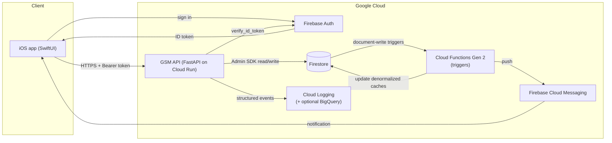
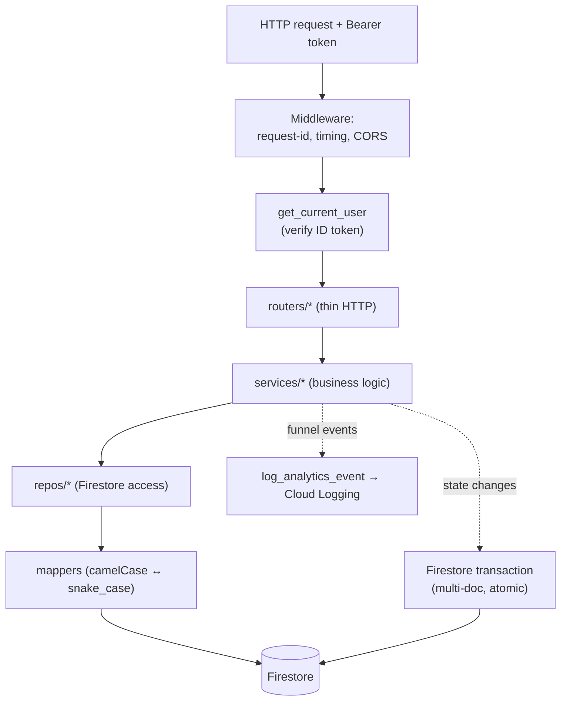
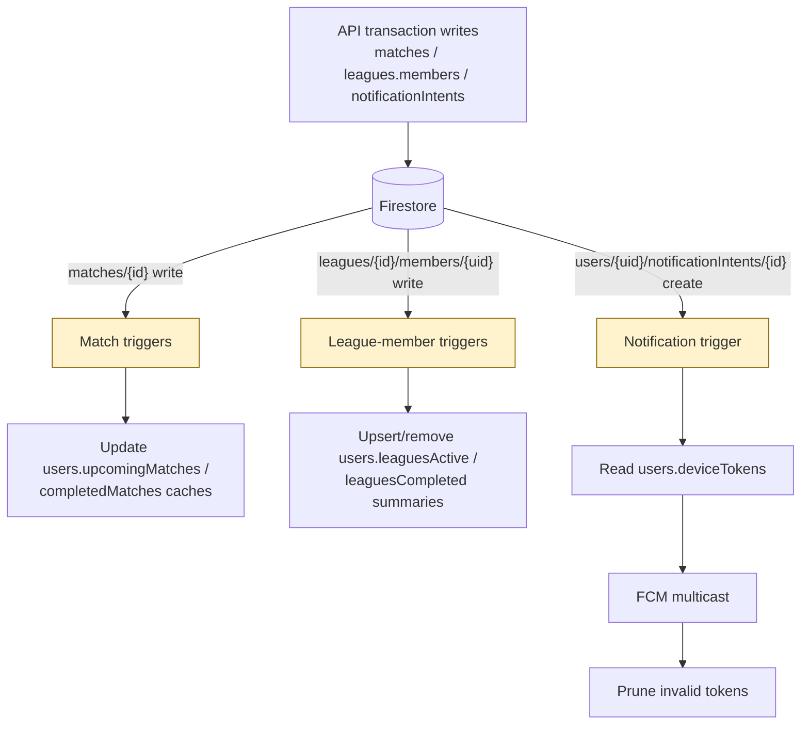

# Architecture Diagrams

Mermaid diagrams render natively on GitHub. Keep these in sync with
[`overview.md`](overview.md), [`triggers.md`](triggers.md), and
[`../api/play-tab-state-machine.md`](../api/play-tab-state-machine.md) (the canonical Play state
machine; not duplicated here).

## System context

The iOS client never reads or writes Firestore directly — all access is through the API
(see [`security.md`](security.md)).

## Request flow (layered)

## Write → trigger fan-out

All trigger handlers respect the `GSM_TRIGGERS_ENABLED` kill switch (highlighted). Details in
[`triggers.md`](triggers.md).

## Match lifecycle

The match status lifecycle (`scheduled → pending_confirmation → completed / disputed / cancelled`)
is documented with its diagram in [`match-lifecycle.md`](match-lifecycle.md). The Play-tab UI state
machine that sits on top of it is in
[`../api/play-tab-state-machine.md`](../api/play-tab-state-machine.md).
