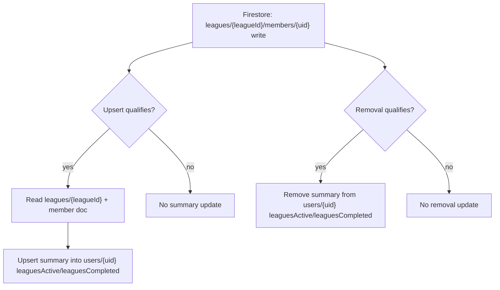

# Cloud Functions Triggers

> Firestore-trigger (Cloud Functions Gen 2) behavior: denormalized cache maintenance,
> league-member summaries, and push-notification delivery. Triggers run **out of band**
> from the API server — they react to Firestore document writes, never to HTTP calls.
> Source: `functions/`. Related diagram: [`diagrams.md`](diagrams.md).

All cache-writing triggers respect the kill switch `GSM_TRIGGERS_ENABLED` (`true` by default);
when `false`, handlers exit early and perform no Firestore writes.

## Match caches (`matches/{matchId}` writes)

**Upcoming-cache qualification.** A match qualifies as "upcoming" when `status == "scheduled"`
and `scheduledAt` is a timezone-aware UTC timestamp strictly in the future. Ignored: deletes,
non-scheduled statuses, past/missing `scheduledAt`, and no-op updates (no change to `status`,
`scheduledAt`, or `participantUids`).

**Upcoming-cache update.** On a qualifying write, a per-user transaction updates each participant's
`users/{uid}` doc:
- `upcomingMatches` — canonical ordered cache (`scheduledAt` ASC, capped at 10)
- `upcomingMatchIds` — derived ID list for compatibility

Updates are idempotent, deduped, ordered, and skipped when the computed cache is unchanged. The
"cache" is a denormalized list on the user doc (not in-memory), enabling a single document read
instead of multiple match queries.

**Completion migration.** On the first `scheduled → completed` transition (requires
`before.status == "scheduled"`, `after.status == "completed"`, and a timezone-aware `finishedAt`),
the match moves per participant from `upcomingMatches` into `completedMatches` (ordered by
`finishedAt` DESC, deduped, capped at 10). `upcomingMatchIds` and `recentCompletedMatchIds` are
updated as derived lists. Idempotent repeats (`completed → completed`) are ignored.

## League-member summaries (`leagues/{leagueId}/members/{uid}` writes)

Maintains the denormalized league summaries on user docs that power fast home/profile reads
(see [`../data/queries-and-indexes.md`](../data/queries-and-indexes.md)).

- **Upsert** (active membership, role/status changed): compose `{leagueId, sport, status, name, role}`
  and upsert into `leaguesActive` (league status `active`) or `leaguesCompleted` (otherwise),
  removing from the other list to keep them disjoint. Deduped by `leagueId`, capped at 20, no-op-safe.
- **Removal** (delete or status → `left`/`banned`): remove the league entry from both lists.
  Idempotent under retries.

## Push-notification delivery (`users/{uid}/notificationIntents/{intentId}` create)

Handler: `functions/notification_triggers/on_notification_intent.deliver_notification_intent`.

Delivers a freshly created notification intent to the user's devices via FCM. Delivery is
best-effort and decoupled from the business transaction that wrote the intent — a send or prune
failure is logged but never raised. From the client's perspective, see
[`../api/notifications.md`](../api/notifications.md).

- Respects the `GSM_TRIGGERS_ENABLED` kill switch.
- Reads `users/{uid}.deviceTokens` and extracts the token strings. No tokens → logs `skip`/`no_tokens`, no FCM call.
- Builds the FCM payload: `title`/`body` become the notification; the `data` map always includes
  `type` plus, when present, `offerId` / `matchId` / `broadcastId` (all values stringified — an FCM requirement).
- Sends via the FCM sender (`functions.notification_triggers.fcm_sender.send`), which returns `(success_count, invalid_tokens)`.
- Prunes any `invalid_tokens` from `users/{uid}.deviceTokens` via a read-modify-write `update`.
- Emits a `deliver` log with `tokens_count`, `success_count`, `pruned_count`.

## Structured logs & counters

Trigger paths emit structured JSON logs with: `trigger`, `action`, `matchId`/`leagueId`,
`uid` (or `uids_count` + `uids_preview` for batch context), `changed`, and `reason` (for
ignores/non-qualification). Each invocation also emits aggregated counters: `processed_count`,
`ignored_count`, `writes_count`. A typical flow: `qualify` log → `ignore` log when early-exiting
→ per-user write log (`upsert`/`migrate`/`remove`) with `changed` → `summary` log with counters.
