**GSM — Grand Slam Matchmaking**

Functional & Interaction Specification

Tab 1: PLAY  ·  Tab 2: IMPROVE  ·  Tab 3: THE LAB  ·  Tab 4: THE CLUBHOUSE  ·  Authentication  ·  Triggers

**Version 1.4 — March 2026**

*Audience: Mobile Team, Backend Engineers, Product & Design*

## **Revision History**

| Version | Date | Author | Changes |
| :---- | :---- | :---- | :---- |
| 1.0 | February 2026 | Ignatios Charalampidis | Initial release: Tab 1 (PLAY) and Tab 2 (IMPROVE) functional spec with sequence diagrams |
| 1.1 | February 2026 | Ignatios Charalampidis | Added Authentication & Authorization (Section 2), Cloud Functions D-Series triggers (Section 5), Cross-Tab Integration (Section 6\) |
| **1.2** | **March 2026** | **Ignatios Charalampidis** | **Added Tab 3: THE LAB (Section 6\) — scoring engine, Skill DNA, rivalry, community intelligence, leaderboards. Draft endpoints and workflows; to be revisited after code is finalised.** |
| **1.3** | **March 2026** | **Ignatios Charalampidis** | **Added Tab 4: THE CLUBHOUSE (Section 7\) — Athlete Card, Local Pulse activity feed, streak/personal best tracking. Draft; pending product decisions (OQ-1–OQ-5) and subject to revision after implementation.** |
| **1.4** | March 2026 | Ignatios Charalampidis | Added Venue Data Model (Section 10\) — VenueRef value object, venues collection, Google Places proxy, broadcast/offer/match integration. Added Doubles Match Support (Section 11\) — MatchTypeEnum, ParticipantEntry, 4-player match lifecycle, doubles scoring formula. Both required for padel-first launch. |

# **Table of Contents**

**1\. Introduction & Purpose**

**2\. Authentication & Authorization**

   2.1 Overview

   2.2 Token Verification Flow

   2.3 Authorization Helpers

   2.4 League Membership & Roles

   2.5 Sequence Diagram

**3\. Tab 1: PLAY — The Matchmaking Engine**

   3.1 Overview & Design Philosophy

   3.2 State Machine (9 States)

   3.3 API Endpoints Reference

   3.4 Scenario Walkthroughs

   3.5 Sequence Diagrams (Mermaid)

**4\. Tab 2: IMPROVE — The Performance Journal**

   4.1 Overview & Design Philosophy

   4.2 Functional Features

   4.3 API Endpoints Reference

   4.4 Sequence Diagrams (Mermaid)

**5\. Cloud Functions & Triggers (D-Series)**

   5.1 Overview & Architecture

   5.2 D1: Match → Upcoming Cache

   5.3 D2: Match Completion Migration

   5.4 D3: League Member Cache

   5.5 D4: Skill DNA Aggregation  [NEW in v1.2]

   5.6 D5: Scoring & Ranking Triggers  [NEW in v1.2]

   5.7 D6: Operational Controls

   5.8 D7: Scheduled Functions  [NEW in v1.2]

   5.9 Trigger Flow Diagrams (Mermaid)

**6\. Tab 3: THE LAB — The Analytics Engine  [NEW in v1.2]**

   6.1 Overview & Design Philosophy

   6.2 Implementation Phases

   6.3 Phase 1: Scoring Engine & Progression

   6.4 Phase 2: Skill DNA & Head-to-Head Rivalry

   6.5 Phase 3: Community Intelligence

   6.6 Phase 4: AI & Premium Features

   6.7 API Endpoints Reference (All Phases)

   6.8 Data Models

   6.9 Sequence Diagrams (Mermaid)

**7\. Tab 4: THE CLUBHOUSE — The Social Layer  [NEW in v1.3]**

   7.1 Overview & Design Philosophy

   7.2 MVP Scope & Phases

   7.3 Phase 1: Athlete Card & Profile

   7.4 Phase 2: Local Pulse Activity Feed

   7.5 Deferred Features

   7.6 API Endpoints Reference

   7.7 Data Models

   7.8 Open Product Questions

   7.9 Sequence Diagrams (Mermaid)

**8\. Venue & Court Data Model  [NEW in v1.4]**

   8.1 Overview & Design Decisions

   8.2 Firestore Schema

   8.3 Pydantic Models

   8.4 API Endpoints Reference

   8.5 Broadcast & Match Integration

   8.6 Sequence Diagrams (Mermaid)

**9\. Doubles Match Support  [NEW in v1.4]**

   9.1 Overview & Design Decisions

   9.2 Firestore Schema Changes

   9.3 New Enums & Models

   9.4 Modified Endpoints

   9.5 Scoring Engine (Doubles)

   9.6 State Machine Impact

   9.7 Sequence Diagrams (Mermaid)

**10\. Cross-Tab Integration  (updated in v1.3)**

**11\. Appendix: Diagram Index  (updated in v1.3)**

# **1\. Introduction & Purpose**

This document provides a comprehensive functional and interaction specification for the GSM (Grand Slam Matchmaking) mobile application. It covers the four primary tabs (PLAY, IMPROVE, THE LAB, and THE CLUBHOUSE), the authentication and authorization system, and the Cloud Functions trigger pipeline that keeps denormalized caches in sync.

GSM is a next-generation social sports app for tennis, padel, and pickleball. Its mission is to become the global standard for amateur sports scoring and matchmaking — the “ATP for Amateurs.” The core value proposition is minimizing “Time-to-Court” by removing all friction from the matchmaking process.

### **Technology Stack**

* Backend: FastAPI (Python 3.11+) with Pydantic v2  
* Database: Google Firestore (Native mode) with denormalized caches  
* Auth: Firebase Auth (Bearer tokens) with custom claims for roles  
* Infrastructure: Cloud Run (API, region europe-west8) + Cloud Functions Gen 2 (triggers)  
* CI/CD: GitHub Actions with Workload Identity Federation (WIF)  
* State Management: Persisted playTab map on user doc, reconciled on read

# **2\. Authentication & Authorization**

## **2.1 Overview**

GSM uses Firebase Authentication as its identity provider. Every protected API endpoint requires a valid Firebase ID token passed in the Authorization header. The system is split into two layers: authentication (proving identity, returning 401 on failure) and authorization (checking permissions, returning 403 on failure).

### **Key Design Decisions**

* Bearer token scheme: all clients send Authorization: Bearer <id_token> on every request.  
* Firebase Admin SDK verification: the backend uses firebase_admin.auth.verify_id_token to validate tokens, checking issuer, audience, and expiration.  
* Custom claims for roles: global roles (admin, player, editor) are embedded in the token as custom claims, enabling role checks without Firestore reads.  
* Firestore-backed league roles: league-specific permissions (owner, admin, member) are resolved via membership docs at leagues/{leagueId}/members/{uid}.  
* Dependency injection: FastAPI Depends() pattern wires auth into every route cleanly and allows easy test overrides.

## **2.2 Token Verification Flow**

When a request arrives at any protected endpoint, the get_current_user dependency executes the following steps: parse the Authorization header, call firebase_admin.auth.verify_id_token, verify aud and iss match the project, extract uid/email/picture/roles from decoded claims, and return a CurrentUser Pydantic model.

### **CurrentUser Model**

| Field | Type | Description |
| :---- | :---- | :---- |
| uid | str | Firebase user ID — primary identifier for all ownership checks |
| email | str | None | User’s email address from the token |
| issuer | str | None | Token issuer URL (securetoken.google.com/{project}) |
| picture | str | None | Profile picture URL from Firebase Auth provider |
| roles | list[str] | None | Custom claim roles (e.g., ["admin", "player"]) |

### **Error Responses**

| Status | Condition | Detail Message |
| :---- | :---- | :---- |
| 401 | Missing Authorization header | Missing Authorization header |
| 401 | Non-Bearer scheme or empty token | Invalid Authorization header format |
| 401 | Invalid/expired/revoked token | Invalid Firebase ID token |
| 401 | Token audience or issuer mismatch | Token not issued for this project |
| 403 | Caller UID does not match target resource | You do not own this resource |
| 403 | Caller lacks required role or membership | Missing required role |

## **2.3 Authorization Helpers**

Once authentication succeeds (CurrentUser is available), authorization helpers enforce fine-grained access control. These helpers only raise 403 — never 401\.

| Helper | Parameters | Behavior |
| :---- | :---- | :---- |
| require_self(user, uid) | CurrentUser, target UID | Raises 403 if user.uid != target. Used on /users/{uid} and /me/* endpoints. |
| require_roles(user, roles) | CurrentUser, list[str] | All specified roles must be present in token claims. Empty list is a no-op. |
| require_any_role(user, roles) | CurrentUser, list[str] | At least one role must match. Empty list is a no-op. |
| is_admin(user) | CurrentUser | Returns True if roles contain admin, administrator, or superadmin (case-insensitive). |
| require_membership(...) | user, league_id, role_service, role? | Allows if: global role match OR league owner OR Firestore membership doc exists with matching role. |

## **2.4 League Membership & Roles**

League-specific authorization is handled by the RoleService, which reads Firestore membership documents. Resolution order: (1) Global token role, (2) League ownership, (3) Membership document, (4) 403 if none pass.

## **2.5 Authentication Sequence Diagram**

**Diagram A1: Authentication & Authorization Flow**

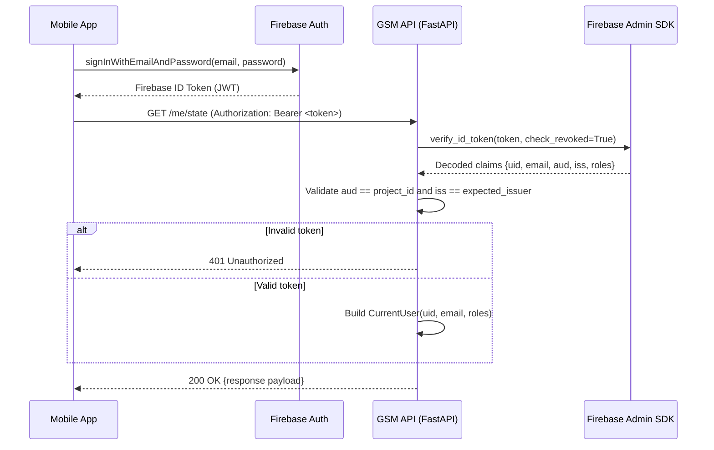

# **3\. Tab 1: PLAY — The Matchmaking Engine**

## **3.1 Overview & Design Philosophy**

Tab 1 is the heart of GSM. It is a dynamic state machine that adapts the entire UI to the user’s immediate context in the match lifecycle.

### **Core Principles**

* Minimize Time-to-Court: The “Ready to Play” button is the largest element on screen. Finding a match should feel brainless.  
* State-driven UI: The mobile client polls GET /me/state and renders the appropriate screen. No client-side state guessing.  
* Freshness Reconciliation: Time-based transitions (broadcast expiry, offer TTL, match start) are corrected on every GET /me/state read.  
* One Active Broadcast per User: Broadcasts stay active while incoming offers queue up. The user picks from multiple challengers.

## **3.2 State Machine (9 States)**

Tab 1 operates as a finite state machine with 9 discrete states. Each state dictates what the mobile UI renders and which actions are available.

| # | State | Description | UI Rendered |
| :---- | :---- | :---- | :---- |
| 1 | DISCOVERY | Default browse state | Map + player list + FAB |
| 2 | BROADCAST_ACTIVE | User broadcasting availability | Live status bar + offer inbox |
| 3 | OUTGOING_OFFER_PENDING | User sent a challenge | Waiting card + timer |
| 4 | INCOMING_OFFER_PENDING | User received a challenge (no broadcast) | Accept/Decline card + timer |
| 5 | MATCH_SCHEDULED | Confirmed upcoming match | Logistics card + scouting |
| 6 | POST_MATCH_LOG_AVAILABLE | Match time passed | Score dial + LOG button |
| 7 | POST_MATCH_WAITING_OPPONENT | User logged result first | Waiting for confirmation |
| 8 | POST_MATCH_CONFIRM_REQUIRED | Opponent logged result first | Confirm/Dispute card |
| 9 | MATCH_DISPUTED | Conflicting score submissions | Dispute resolution UI |

**State Transition Diagram (Mermaid)**

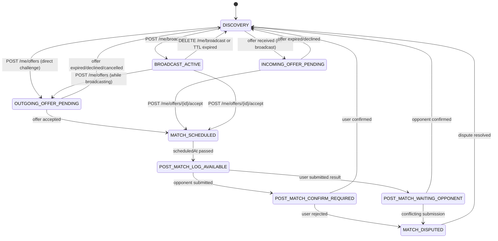

### **Time-Based Freshness Reconciliation**

| Stale State | Condition | Corrected To |
| :---- | :---- | :---- |
| BROADCAST_ACTIVE | broadcast.expiresAt < now | DISCOVERY |
| OUTGOING_OFFER_PENDING | offer.expiresAt < now | DISCOVERY or BROADCAST_ACTIVE |
| INCOMING_OFFER_PENDING | offer.expiresAt < now | DISCOVERY |
| MATCH_SCHEDULED | match.scheduledAt < now | POST_MATCH_LOG_AVAILABLE |

## **3.3 API Endpoints Reference**

| # | Method | Path | Purpose | State Change |
| :---- | :---- | :---- | :---- | :---- |
| 1 | GET | /me/state | Current Tab 1 state + payload | Read-only + reconcile |
| 2 | POST | /me/broadcast | Start availability broadcast. v1.4: accepts venue_ref, match_type, broadcast_type, partner_uid | DISCOVERY → BROADCAST |
| 3 | DELETE | /me/broadcast | Cancel active broadcast | BROADCAST → DISCOVERY |
| 4 | POST | /me/offers | Send a challenge offer. v1.4: accepts match_type, partner_uid, venue_ref | Various → OUTGOING |
| 5 | POST | /me/offers/{id}/accept | Accept incoming offer. v1.4: creates 2 or 4-participant match with venue + team assignments | Various → SCHEDULED |
| 6 | POST | /me/offers/{id}/decline | Decline incoming offer | INCOMING → prev state |
| 7 | POST | /me/offers/{id}/cancel | Cancel outgoing offer | OUTGOING → prev state |

## **3.4 Scenario Walkthroughs**

### **Scenario 1: Broadcast → Receive Offer → Accept → Play → Log Score**

* Alice opens Tab 1 → GET /me/state returns DISCOVERY  
* Alice taps “I’M READY TO PLAY” → POST /me/broadcast → BROADCAST_ACTIVE  
* Bob sees Alice, taps “Challenge” → POST /me/offers → Bob: OUTGOING_OFFER_PENDING  
* Alice polls → GET /me/state shows incoming offer (state stays BROADCAST_ACTIVE)  
* Alice accepts → POST /me/offers/{id}/accept: creates match, cancels broadcast, declines other offers  
* Both → MATCH_SCHEDULED (logistics card + scouting report)  
* Match time passes → freshness reconciliation → POST_MATCH_LOG_AVAILABLE  
* Alice logs score → POST /matches/{id}/result → Alice: WAITING_OPPONENT  
* Bob confirms → POST /matches/{id}/confirm → Both: DISCOVERY, rankings updated

### **Scenario 2: Direct Challenge (No Broadcast)**

* Charlie taps Diana’s card → POST /me/offers → Charlie: OUTGOING, Diana: INCOMING  
* Diana accepts → both → MATCH_SCHEDULED

### **Scenario 3: Broadcast Expires / Cancel**

* Manual cancel: DELETE /me/broadcast → decline all offers → DISCOVERY  
* TTL expiry: freshness reconciliation corrects to DISCOVERY, returns uiEvent: broadcast_expired

### **Scenario 4: Score Dispute**

* Both players submit conflicting scores → MATCH_DISPUTED  
* Dispute resolution UI shows both scores, requires manual resolution

## **3.5 Sequence Diagrams (Mermaid)**

**Diagram 1: Full Broadcast → Match → Score Flow**

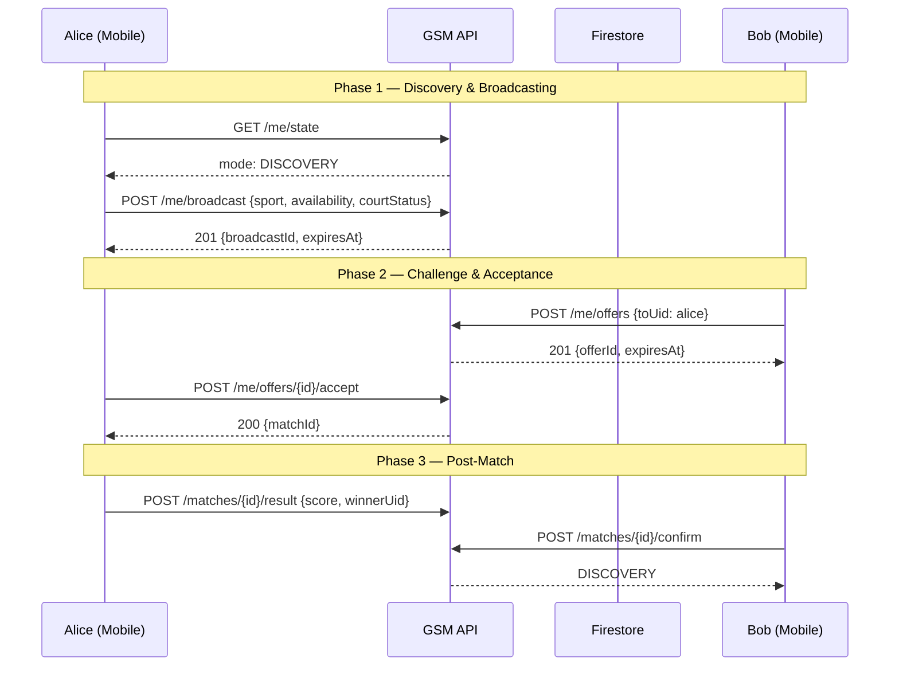

**Diagram 2: Direct Challenge (No Broadcast)**

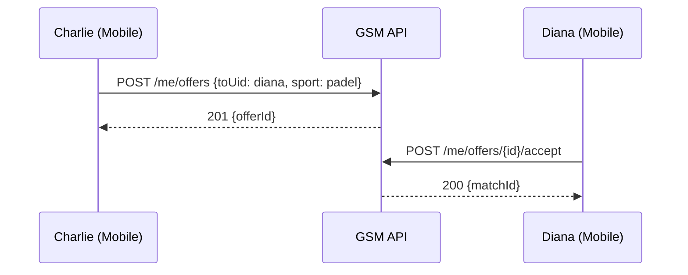

**Diagram 3: Offer Expiry & Broadcast Cancellation**

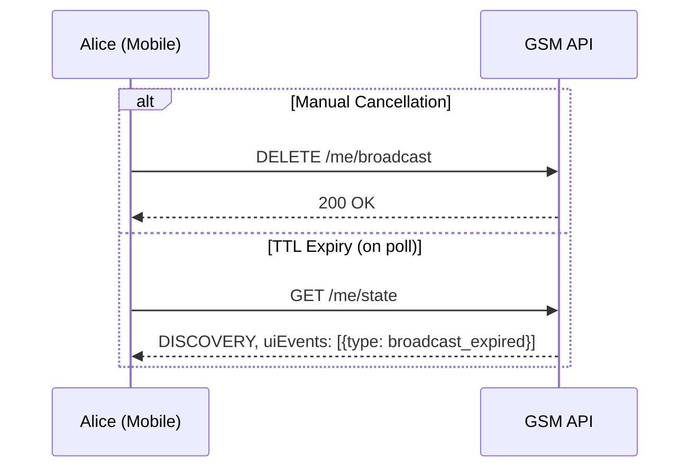

**Diagram 4: Score Dispute Flow**

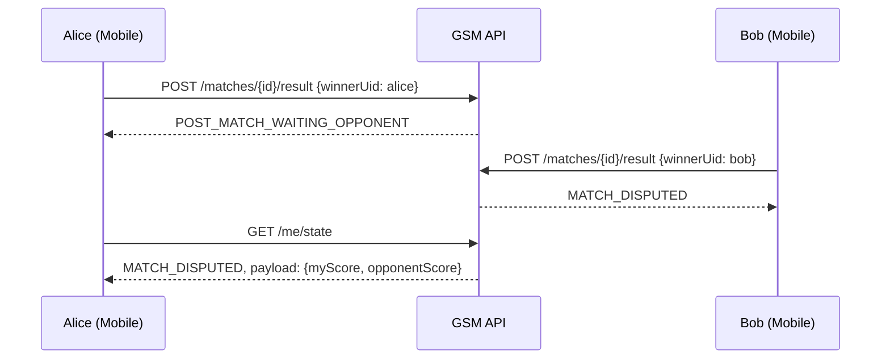

# **4\. Tab 2: IMPROVE — The Performance Journal**

## **4.1 Overview & Design Philosophy**

Tab 2 is the “Digital Training Partner” — a dedicated space for players to log match results, training sessions, and personal reflections. The core problem it solves: amateur players plateau because their training is reactive and their match reflections are lost to memory.

* Under 30-Second Entry: Pill-based selection UI for speed. Log while still on the court.  
* Two Entry Types: Match logs (linked to completed matches) and Training logs (standalone sessions).  
* The Review Loop: Structured reflections feed into scouting reports on Tab 1\.  
* Compute-on-Read Stats: Dashboard statistics derived from cached profile data with zero additional Firestore reads.

## **4.2 Functional Features**

### **Match Log**

Create a journal entry linked to a completed match. Auto-populates opponent, score, and result from the match doc. User adds notes, skill tags, and optional reflection.

### **Training Log**

Standalone sessions with focus area pills (Serve, Volley, Footwork, Cardio), duration in minutes, and optional notes. No match linkage.

### **Structured Reflection**

3-step post-match review: “What went well?” / “What went wrong?” (internal), and “Opponent weaknesses” / “Opponent strengths” (opponent focus). Tags are mapped to opponent UID for the scouting pipeline.

### **North Star Goal**

A single active goal displayed on the dashboard (e.g., “Reduce double faults by 20%”). Setting a new goal resets progress to 0%.

### **Dashboard Stats**

7-day activity calendar, streak count, total matches, wins, and training sessions. Computed on-read from cached data.

## **4.3 API Endpoints Reference**

| # | Method | Path | Purpose |
| :---- | :---- | :---- | :---- |
| 1 | GET | /me/journal | List journal entries (paginated, cursor-based, newest first) |
| 2 | POST | /me/journal | Create a journal entry (match or training) |
| 3 | GET | /me/journal/{entry_id} | Fetch a single journal entry |
| 4 | PATCH | /me/journal/{entry_id} | Update entry with reflection, tags, or body |
| 5 | GET | /me/stats | Dashboard stats (weekly activity, streaks, totals) |
| 6 | PUT | /me/north-star | Set/overwrite the North Star goal |
| 7 | GET | /me/north-star | Retrieve current North Star goal |

## **4.4 Sequence Diagrams (Mermaid)**

**Diagram 5: Match Journal Entry & Reflection**

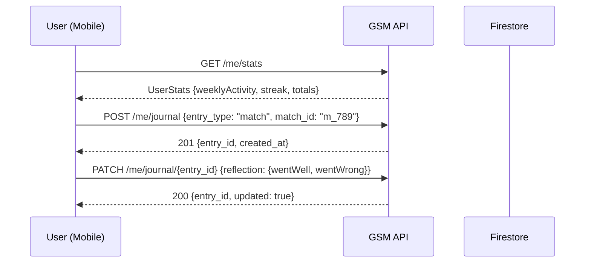

**Diagram 6: Training Session Log**

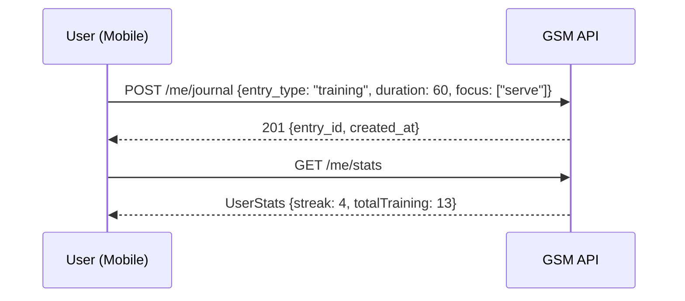

**Diagram 7: North Star Goal**

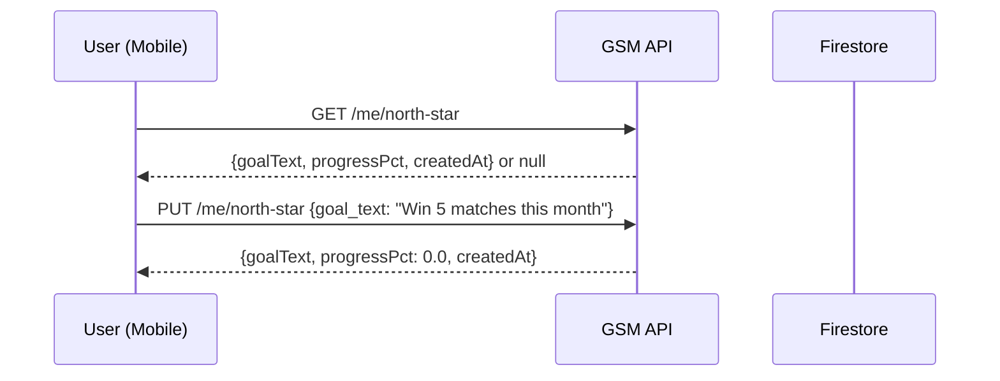

**Diagram 8: Journal Browsing & Pagination**

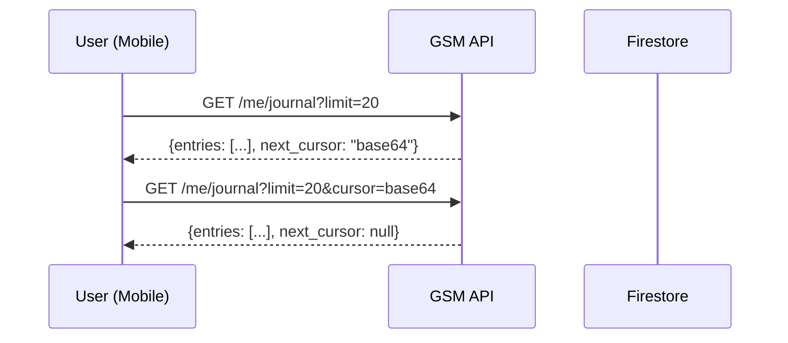

# **5\. Cloud Functions & Triggers (D-Series)**

## **5.1 Overview & Architecture**

GSM uses Cloud Functions for Firebase (Gen 2\) to maintain denormalized caches on user documents. These functions run as Firestore triggers — they fire automatically when documents are created, updated, or deleted.

### **Key Design Principles**

* Idempotent: triggers may fire multiple times for the same event. All update logic is deduped.  
* Transactional: each cache update uses a Firestore transaction to prevent race conditions.  
* Capped: all cache arrays have a maximum size (typically 10–20 entries).  
* Kill switch: GSM_TRIGGERS_ENABLED env var stops all trigger writes without redeploying.  
* Structured logging: every trigger emits JSON log lines with standardized fields.

## **5.2 D1: Match → Upcoming Cache**

Trigger: Firestore write on matches/{matchId}. When a new match is scheduled, push a summary into each participant’s upcomingMatches cache.

## **5.3 D2: Match Completion Migration**

Trigger: Firestore update on matches/{matchId}. When a match transitions from scheduled to completed, migrate from upcomingMatches to completedMatches cache on each participant’s user doc.

## **5.4 D3: League Member Cache**

Trigger: Firestore write on leagues/{leagueId}/members/{uid}. Maintains league summary arrays on user documents for home screen and profile display.

## **5.5 D4: Skill DNA Aggregation**

*[NEW in v1.2]*

Trigger: Firestore write on users/{uid}/journalEntries/{id} (create or update). Maps skill tags to radar axes via config/skillTaxonomy and updates the user’s denormalized skillDna map.

| Sub-ID | Purpose | Behavior |
| :---- | :---- | :---- |
| D4.1 | Qualification: has reflection with tags? | Map tags to axes via config/skillTaxonomy. Ignore entries with no reflection. |
| D4.2 | Update skillDna counters | Increment positive/negative counts per axis on users/{uid}.skillDna.{sport}. Recompute score. |
| D4.3 | Update scouting profile (Phase 3\) | If reflection contains opponentWeak/opponentStrong tags, increment counters on scouting/{opponentUid}. |

## **5.6 D5: Scoring & Ranking Triggers**

*[NEW in v1.2]*

These triggers fire asynchronously after the match confirmation transaction commits. Scoring itself runs inline for instant gratification; these handle the eventual-consistency global state.

| Sub-ID | Purpose | Behavior |
| :---- | :---- | :---- |
| D5.1 | Global ranking recomputation | On match completion: reads all users with rankings.{sport}.pts, sorts, writes globalRanking ordinals. Sets lastUpdated. |
| D5.2 | League member stats update | If match.leagueId is set: update leagues/{leagueId}/members/{uid}.stats with win/loss counts. |

### **D-Series Trigger Updates for Doubles  [NEW in v1.4]**

All D-series triggers that iterate over match participants are updated to handle 4-participant matches:

* **D1 (Match → Upcoming Cache):** Pushes summary to all UIDs in participants array (2 or 4).

* **D2 (Match Completion Migration):** Migrates cache for all UIDs in participants array.

* **D5.1 (Global Ranking):** No change — reads all users with rankings regardless of match type.

* **D5.2 (League Member Stats):** Updates stats for all participants in a league match.

The iteration logic is unchanged; triggers read from the participants array instead of the implicit 2-UID list.

## **5.7 D6: Operational Controls**

D6.2 — Trigger Kill Switch: All D-series triggers check GSM_TRIGGERS_ENABLED at invocation start. When false, the handler exits immediately with structured log.

D6.3 — Structured Logging: Every trigger invocation emits JSON log lines with trigger name, action, matchId/leagueId, uid, changed flag, and summary counters.

## **5.8 D7: Scheduled Functions**

*[NEW in v1.2]*

| Sub-ID | Schedule | Purpose | Behavior |
| :---- | :---- | :---- | :---- |
| D7.1 | Hourly | Leaderboard snapshots | Reads all users with rankings.{sport}.pts per region, sorts, writes leaderboards/{region}_{sport}. Computes rising stars. |
| D7.2 | Daily | Ticker cleanup | Removes expired ticker entries (createdAt > 24h) or relies on Firestore TTL policy. |
| D7.3 | Hourly | Tier averages | Computes average Skill DNA per tier, writes to config/tierAverages for comparison mode. |

## **5.9 Trigger Flow Diagrams (Mermaid)**

**Diagram 9: onMatchWrite Trigger Flow**

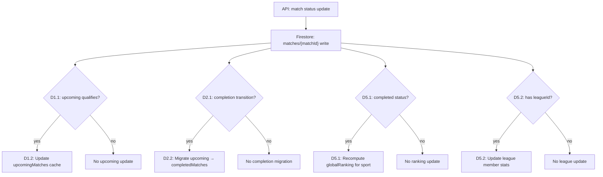

**Diagram 10: onLeagueMemberWrite Trigger Flow**

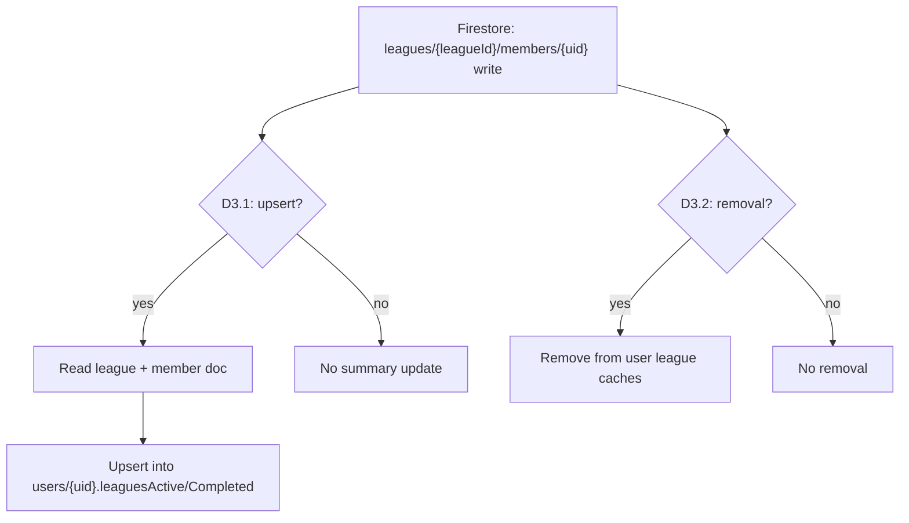

**Diagram 10b: onJournalWrite Trigger Flow (NEW)**

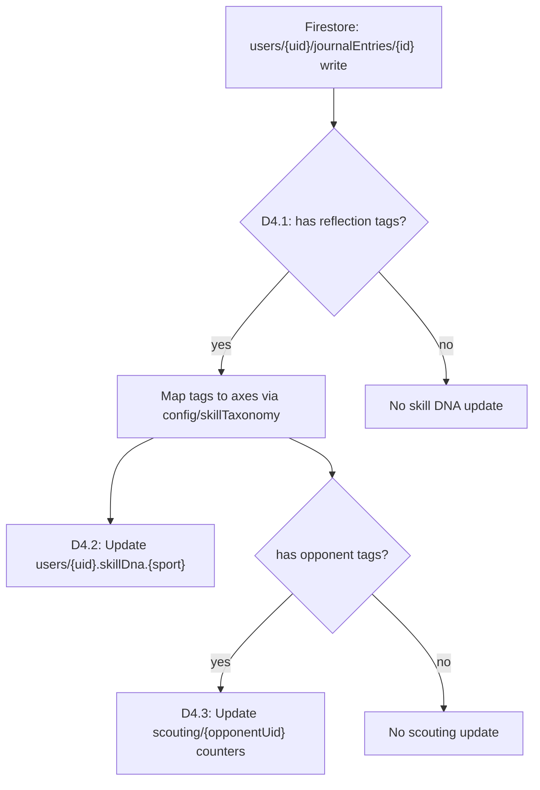

**Diagram 11: Match Lifecycle End-to-End (API + Triggers + Scoring)**

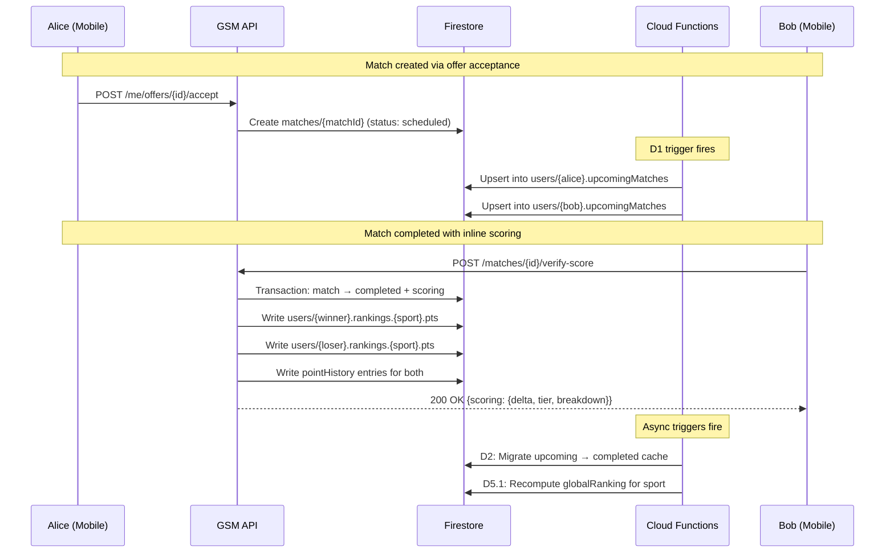

# **6\. Tab 3: THE LAB — The Analytics Engine**

*NEW in v1.2 — Draft: endpoints and workflows to be revisited after code is finalised.*

## **6.1 Overview & Design Philosophy**

Tab 3 is the “Brain” of the GSM ecosystem — where raw data from the Play and Improve tabs is synthesised into proprietary scouting reports, standardised rankings, and performance analytics. The goal is to provide “Professional Intelligence for the Amateur.”

### **Core Principles**

* Instant gratification: the player who confirms a match sees their updated score immediately. No waiting for background jobs.  
* Eventual consistency for global state: rankings, leaderboards, and opponent score updates propagate asynchronously via triggers.  
* Per-sport isolation: a user’s tennis score is independent of their padel score. Each sport has its own point track.  
* Auditability: every point change is recorded in a time-series subcollection with a reason code. No silent mutations.  
* Rebalanceable tiers: tier thresholds are stored as configuration, not hardcoded.

### **The Three Pillars**

* The Performance Moat (Progression Graph): A 1000–4000+ point line chart showing the user’s “stock price” over time with tier threshold markers.  
* The Skill DNA (Radar Chart): A 5-axis spider chart (Serve, Power, Net Play, Stamina, Mental) derived from Tab 2 reflections.  
* Community Intelligence (Scouting, Leaderboards, Ticker): Crowd-sourced opponent profiles, regional rankings, and a live upsets feed.

## **6.2 Implementation Phases**

| Phase | Scope | Dependencies |
| :---- | :---- | :---- |
| Phase 1 | Scoring Engine & Progression Graph — points, tiers, pointHistory, inline scoring | None (foundation) |
| Phase 2 | Skill DNA & Head-to-Head Rivalry — tag taxonomy, radar chart, win probability | Phase 1 (scoring must be live) |
| Phase 3 | Community Intelligence — scouting profiles, leaderboards, upsets ticker | Phase 1 + Phase 2 (reflection tags) |
| Phase 4 | AI & Premium — Danger Zone, Win Predictor, AI Training Plans | Phases 1–3 (requires data volume) |

## **6.3 Phase 1: Scoring Engine & Progression Graph**

Every confirmed match produces a score change. Users can see their point history over time. Scoring executes inline within the match confirmation transaction for instant UI feedback.

### **Scoring Formula**

| Outcome | Points Change | Condition |
| :---- | :---- | :---- |
| Win (standard) | +100 | Beating an opponent in the same tier |
| Win (upset bonus) | +50 additional | Beating an opponent in a higher tier |
| Win (Elo bonus) | +5% of point difference | Beating someone with significantly higher points |
| Loss (downward) | −50 | Losing to an opponent in a lower tier |
| Loss (standard) | 0 | Losing to someone in the same or higher tier |

### **Tier Thresholds**

Stored in config/tiers as a Firestore document (not hardcoded). Tiers are derived on-read from the user’s pts + threshold config.

| Tier | Min Points | Max Points | Point Floor |
| :---- | :---- | :---- | :---- |
| Amateur | 1000 | 1999 | 1000 |
| Intermediate | 2000 | 2999 | 2000 |
| Advanced | 3000 | 3999 | 3000 |
| Competitive | 4000 | ∞ | 4000 |

Floor enforcement: each user has a registrationTier set at signup. Their points can never drop below that tier’s starting value, preventing score tanking.

### **Execution Trigger**

Scoring runs inline within the POST /matches/{matchId}/verify-score transaction. This is the same transaction that sets match status to completed. The confirming player sees their new score instantly in the “Victory Animation.” After the transaction commits, async triggers (D5.1, D5.2) handle global ranking recomputation and league stats.

### **Confirm Endpoint Response (Extended)**

| Field | Type | Description |
| :---- | :---- | :---- |
| scoring.sport | string | Which sport was scored |
| scoring.yourPtsBefore | number | Points before the match |
| scoring.yourPtsAfter | number | Points after the match |
| scoring.delta | number | Net points gained/lost |
| scoring.breakdown.baseWin | number | Base +100 for a win |
| scoring.breakdown.upsetBonus | number | +50 if opponent was higher tier |
| scoring.breakdown.eloBonus | number | 5% of point gap bonus |
| scoring.breakdown.penalty | number | −50 if lost to lower tier |
| scoring.tierBefore | string | Tier classification before |
| scoring.tierAfter | string | Tier classification after |
| scoring.tierCrossed | boolean | Whether a tier boundary was crossed |

### **Point History (Progression Graph Data Source)**

Path: users/{uid}/pointHistory/{entryId}. A time-series subcollection recording every point change.

| Field | Type | Required | Description |
| :---- | :---- | :---- | :---- |
| sport | string (enum) | Yes | Which sport this entry is for |
| pts | number | Yes | Point total after this event |
| delta | number | Yes | Points gained or lost |
| reason | string (enum) | Yes | match_win, match_loss, upset_bonus, penalty, admin_adjustment, tier_rebalance |
| matchId | string | Conditional | Reference to the match (null for admin adjustments) |
| opponentUid | string | Conditional | Opponent’s UID |
| opponentPtsBefore | number | Conditional | Opponent’s points before match |
| createdAt | timestamp | Yes | When this event occurred |
| tierBefore | string | Optional | Tier before this event |
| tierAfter | string | Optional | Tier after this event |

## **6.4 Phase 2: Skill DNA & Head-to-Head Rivalry**

### **6.4.1 Skill DNA**

Tab 2’s MatchReflection stores free-form tags. These map to 5 radar axes via a configurable taxonomy stored in config/skillTaxonomy. Aggregation: denormalised skillDna map on the user doc, updated by the D4 trigger. Score per axis = round(positive / (positive + negative) * 100). Minimum 3 data points before displaying a score. Comparison Mode: average Skill DNA of users one tier above, pre-computed in config/tierAverages.

### **6.4.2 Head-to-Head Rivalry**

Every match doc gets a participantPair field — a deterministic string of two UIDs in lexicographic order. Win Probability: computed on-read using a sigmoid formula based on point difference. A 500-point advantage yields approximately 75% win probability.

## **6.5 Phase 3: Community Intelligence**

### **6.5.1 Scouting Profiles**

Path: scouting/{uid}. One document per player aggregating community observations. Privacy: reports never reveal reporter identities. Updated by D4.3.

### **6.5.2 Leaderboards**

Path: leaderboards/{region}_{sport}. Pre-computed snapshots written hourly by D7.1. Contains top entries sorted by pts, plus “Rising Stars.” Region resolution: derived from users/{uid}.preferences.area via config/regions.

### **6.5.3 Upsets Ticker**

Path: ticker/{auto}. A capped collection of recent notable events. Written inline during match confirmation when winner_tier < loser_tier (upset condition). 24-hour TTL with scheduled cleanup (D7.2).

## **6.6 Phase 4: AI & Premium Features**

This phase is deliberately left at a high level. Detailed architecture should be written once Phases 1–3 have been in production long enough to understand data patterns.

| Feature | Description | Complexity |
| :---- | :---- | :---- |
| Danger Zone | AI identifies patterns where you lose to a specific opponent. Requires point-by-point data (not yet captured). | Very High |
| Win Predictor | Real-time win probability adjustment based on recent training logs. | High |
| AI Training Plan | Personalised drills based on “went_wrong” trends from skillDna aggregation. | High |
| Scout of the Month | Gamification badge for users whose scouting tags most accurately predict outcomes. | Medium |
| Interactive Haptics | Haptic “clicks” when scrubbing through the progression graph. Mobile-only, no backend. | Low |

## **6.7 API Endpoints Reference (All Phases)**

| # | Method | Path | Purpose | Phase |
| :---- | :---- | :---- | :---- | :---- |
| 1 | POST | /matches/{matchId}/verify-score | Extend: add inline scoring to match confirmation | P1 (Modified) |
| 2 | GET | /me/lab/dashboard | Current points, tier, global rank, basic stats | P1 |
| 3 | GET | /me/lab/progression?sport=tennis | Paginated point history for the Progression Graph | P1 |
| 4 | GET | /me/lab/skill-dna?sport=tennis | Radar chart data + optional comparison tier | P2 |
| 5 | GET | /me/lab/rivalry/{opponentUid}?sport=tennis | H2H stats, win probability, match history | P2 |
| 6 | GET | /me/lab/scouting/{opponentUid}?sport=tennis | Community scouting report for an opponent | P3 |
| 7 | GET | /lab/leaderboard?region=athens&sport=tennis | Regional leaderboard (top 10 + rising stars) | P3 |
| 8 | GET | /lab/ticker?region=athens&sport=tennis | Recent upsets and milestones ticker | P3 |

## **6.8 Data Models**

### **New Firestore Schema (All Phases)**

| Collection / Field | Type | Purpose |
| :---- | :---- | :---- |
| config/tiers | Document | Tier threshold config (rebalanceable) |
| config/skillTaxonomy | Document | Tag → radar axis mapping |
| config/tierAverages | Document | Average Skill DNA per tier (comparison mode) |
| config/regions | Document | Area → region mapping for leaderboards |
| users/{uid}.rankings.{sport}.tier | string | Cached tier derived from pts + thresholds |
| users/{uid}.rankings.{sport}.registrationTier | string | User’s self-selected tier at signup (point floor) |
| users/{uid}.rankings.{sport}.lastUpdated | timestamp | When ranking was last modified |
| users/{uid}/pointHistory/{entryId} | Subcollection | Time-series of every point change |
| users/{uid}.skillDna.{sport} | Map | Denormalised skill radar scores (5 axes) |
| matches/{matchId}.participantPair | String | Lexicographic UID pair for H2H queries |
| scouting/{uid} | Document | Aggregated community observations per player |
| leaderboards/{region}_{sport} | Document | Pre-computed regional leaderboard snapshots |
| ticker/{auto} | Document | Recent notable events (upsets, milestones) |

## **6.9 Sequence Diagrams (Mermaid)**

**Diagram 13: Match Confirmation with Inline Scoring**

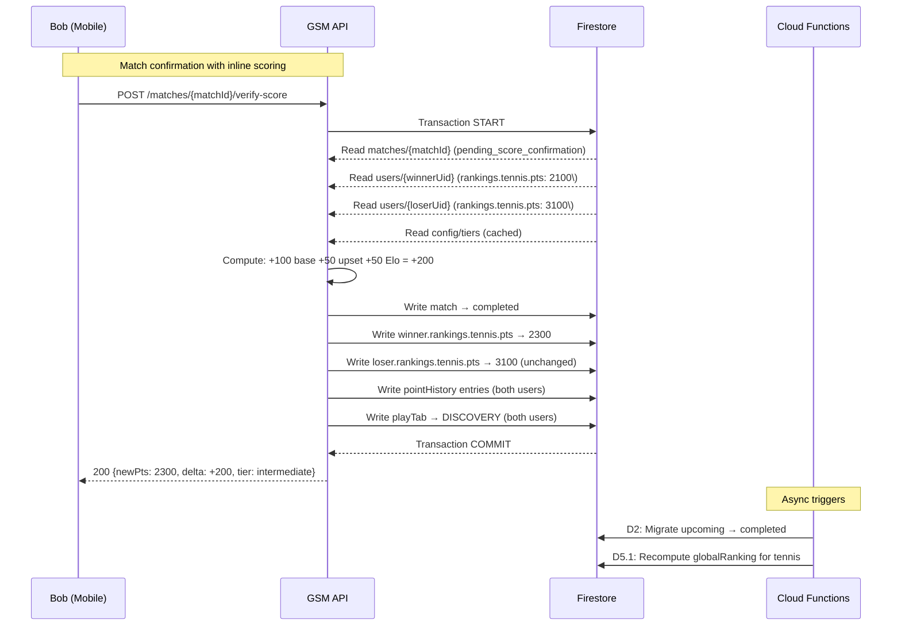

**Diagram 14: Skill DNA Aggregation Flow**

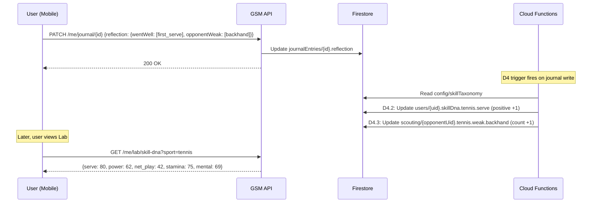

**Diagram 15: Rivalry Scout (Head-to-Head)**

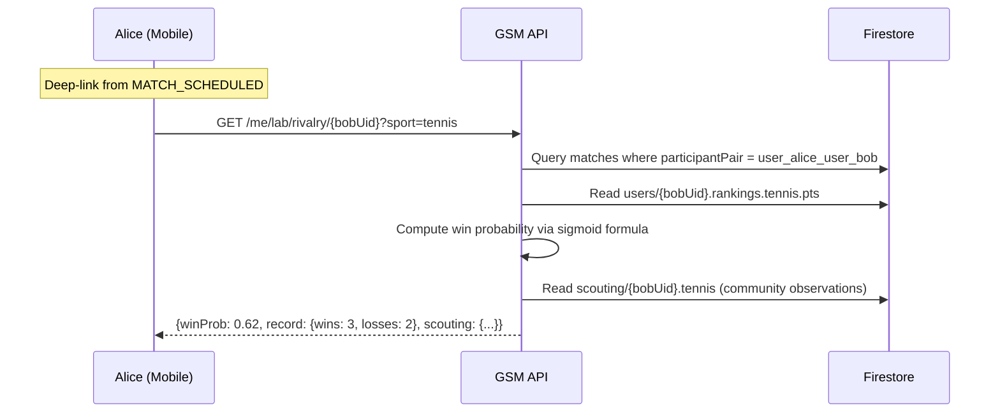

**Diagram 16: Leaderboard Read + Scheduled Computation**

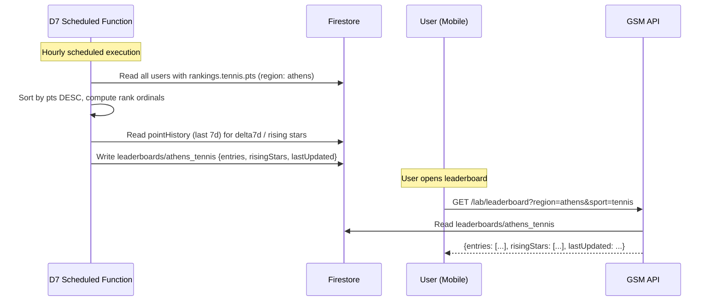

# **7\. Tab 4: THE CLUBHOUSE — The Social Layer**

*NEW in v1.3 — Draft: this section is pending actual implementation and may change based on open product questions (OQ-1 through OQ-5). See §7.8 for the full list.*

## **7.1 Overview & Design Philosophy**

Tab 4 is the social and community anchor of the GSM ecosystem. While Tabs 1–3 cover Execution (PLAY), Improvement (IMPROVE), and Analytics (THE LAB), Tab 4 is the reward — the digital lounge where players display their achievements, follow the local scene, and engage with the community.

### **Core Goal**

Social proof, community retention, and gamified engagement. Tab 4 keeps users in the ecosystem when they aren’t actively matching or training.

### **Design Language**

Consistent with Tabs 1–3: Cyber-Athletic aesthetic with dark mode (Deep Pitch #0A0E12), Volt Green (#BFFF00) for active/primary elements, Electric Blue (#00D1FF) for secondary/data elements, and Steel Gray (#1C2229) card surfaces.

### **Key Decisions (from Gap Analysis)**

* Use existing 4-tier system (Amateur / Intermediate / Advanced / Competitive) for the Athlete Card — no granular “level” system.  
* Reuse the ticker/{auto} collection from Tab 3 for the activity feed (MVP). Dedicated feed collection deferred to follow-up.  
* Charity / Ball Donation flow deferred until a charity partner and payment model are confirmed.  
* Social Groups / “The 3000 Club” deferred — requires its own PRD.  
* Tab 4 is primarily a data consumer, not a data producer. Backend work is lighter than Tabs 1–3.

## **7.2 MVP Scope & Phases**

Tab 4 MVP consists of two phases, both dependent on Tab 3 Phase 1 (scoring engine) being live.

| Phase | Scope | Dependencies |
| :---- | :---- | :---- |
| Phase 1 | Athlete Card & Profile — personalBest, streaks, profile endpoint, Athlete Resume overlay | Tab 3 Phase 1 (SE-1–SE-15) |
| Phase 2 | Local Pulse Activity Feed — new ticker event types, feed event writes during match confirmation, feed endpoint with type filtering | Phase 1 + Tab 3 Phase 3: LAB-19 (ticker schema), LAB-16 (config/regions) |

## **7.3 Phase 1: Athlete Card & Profile**

The user’s digital identity card, assembled from existing cached data on the user doc. The match confirmation transaction is extended to track personal bests and win streaks inline alongside scoring — no new document writes, just additional fields on existing writes.

### **New User Doc Fields**

Three new fields on users/{uid}.rankings.{sport}, updated inline during match confirmation:

| Field | Type | Default | Updated By |
| :---- | :---- | :---- | :---- |
| personalBest | number | null (set on first win) | Match confirmation: when winner’s new pts > existing personalBest |
| currentStreak | number | 0 | Match confirmation: +1 on win, reset to 0 on loss |
| bestStreak | number | 0 | Match confirmation: updated when currentStreak > bestStreak |

All fields are per-sport (tennis streak is independent of padel streak). A loss resets currentStreak to 0; bestStreak is all-time.

### **Athlete Card Display**

* Avatar with tier-coloured ring (Volt Green for active status)  
* Tier badge (e.g., “ADVANCED”) + point total (e.g., “3,600 pts”)  
* Sport selector if user has rankings in multiple sports  
* Tap tier badge → Athlete Resume overlay

### **Athlete Resume (Overlay)**

A shareable summary of the user’s achievements, computed on-the-fly from cached data. No new achievements collection for MVP.

* Personal best per sport (from rankings.{sport}.personalBest)  
* Best win streak per sport (from rankings.{sport}.bestStreak)  
* Total matches played (from completedMatches cache count)  
* Total wins (filtered from completedMatches)  
* Leagues completed (from leaguesCompleted cache count)

### **Profile Endpoint**

A dedicated GET /me/clubhouse/profile endpoint assembles the Athlete Card + Resume data from the user doc. This decouples the mobile team from Firestore field names and allows server-side computed fields to be added later.

## **7.4 Phase 2: Local Pulse Activity Feed**

A regional activity feed showing milestones from nearby players. Reuses the existing ticker/{auto} collection from Tab 3, adding three new event types alongside the existing upset type.

### **Event Types**

| Event Type | Trigger Condition | Written By | Key Fields |
| :---- | :---- | :---- | :---- |
| upset | Winner tier < loser tier | Match confirmation (existing, from LAB-20) | winnerUid, winnerName, loserTier, delta |
| personal_best | Winner’s new pts > personalBest | Match confirmation (new) | userUid, userName, newPts, previousBest |
| win_streak | Winner’s currentStreak hits milestone (3, 5, 10, 20\) | Match confirmation (new) | userUid, userName, streak |
| tier_crossed | Participant’s tierAfter ≠ tierBefore | Match confirmation (new) | userUid, userName, tierBefore, tierAfter, direction |

All events include sport, region (derived from user’s preferences.area via config/regions), and 24-hour TTL. User names formatted as first name + last initial (e.g., “Dana T.”) for privacy.

### **Transaction Impact**

The match confirmation transaction gains 0–3 additional document writes per match (one per triggered event type). Combined with the existing upset write, worst case is 4 ticker writes per match. Transaction goes from ~6 writes (base scoring) to ~10 writes (scoring + streak/PB fields + ticker events). Still well within Firestore’s 500-write limit.

### **Feed Endpoint**

The existing GET /lab/ticker endpoint is extended with an optional types query parameter for event type filtering. When types is omitted, all event types are returned (backwards compatible). When types=upset, only upsets are returned (Tab 3 behaviour). The Clubhouse feed uses types=all or specifies the full list.

### **Feed Privacy**

*Pending OQ-3 resolution. Assumed design:*

* Geographic feed scoped by region (same as leaderboards)  
* feedOptOut boolean on users/{uid}.preferences (default: false)  
* Users who opt out have no ticker events written about them, but can still read the feed  
* User names shown as first name + last initial

## **7.5 Deferred Features**

The following features are explicitly out of scope for the Tab 4 MVP. Each is tracked in spec/tab4-clubhouse-followup.md with prerequisites, open questions, and rough scope estimates.

| ID | Feature | Reason Deferred |
| :---- | :---- | :---- |
| F1 | Activity Feed v2 — dedicated collection with social interactions, longer retention, personalisation | Validate MVP feed retention hypothesis first |
| F2 | League win events in feed | League completion flow must be stable first |
| F3 | Charity / Ball Donation (“Give Back”) | No charity partner or payment model confirmed |
| F4 | Social Groups / “The 3000 Club” (tier-gated groups) | Major feature requiring its own PRD |
| F5 | Broader feed enhancements (training streaks, community milestones, re-match suggestions) | Post-MVP based on engagement data |

## **7.6 API Endpoints Reference**

| # | Method | Path | Purpose | Phase |
| :---- | :---- | :---- | :---- | :---- |
| 1 | GET | /me/clubhouse/profile | Athlete Card + Resume data (all sports) | P1 (New) |
| 2 | GET | /lab/ticker?...&types=... | Extend: add types query parameter for event type filtering | P2 (Modified) |

## **7.7 Data Models**

### **New/Modified Firestore Schema**

| Collection / Field | Type | Purpose |
| :---- | :---- | :---- |
| users/{uid}.rankings.{sport}.personalBest | number | Highest pts ever reached for this sport |
| users/{uid}.rankings.{sport}.currentStreak | number | Consecutive wins (reset to 0 on loss) |
| users/{uid}.rankings.{sport}.bestStreak | number | All-time best consecutive win count |
| users/{uid}.preferences.feedOptOut | boolean | Whether user’s events are excluded from the feed |
| ticker/{auto}.type (extended) | string enum | Add personal_best, win_streak, tier_crossed alongside existing upset |
| ticker/{auto}.userUid | string | Subject of the event (on new event types) |
| ticker/{auto}.userName | string | Denormalized display name (first + last initial) |

## **7.8 Open Product Questions**

*These must be resolved before the functional spec is finalised and implementation begins.*

| ID | Question | Default Assumption |
| :---- | :---- | :---- |
| OQ-1 | Sharing infrastructure: native iOS share sheet vs. Instagram-specific API? | Native iOS share sheet for MVP |
| OQ-2 | Athlete Resume: stats-only (on-the-fly) vs. badge/achievement system with dedicated collection? | Stats-only, computed on-the-fly |
| OQ-3 | Feed privacy: geographic visibility, opt-out toggle, name format? | Geographic feed, feedOptOut boolean, first + last initial |
| OQ-4 | Streak milestones: which thresholds trigger feed events? Per-sport or cross-sport? | Thresholds at {3, 5, 10, 20}, per-sport, loss resets to 0 |
| OQ-5 | Empty states: what do new users and quiet regions see? | Backend returns empty arrays; mobile handles display |

## **7.9 Sequence Diagrams (Mermaid)**

**Diagram 18: Athlete Card Profile Load**

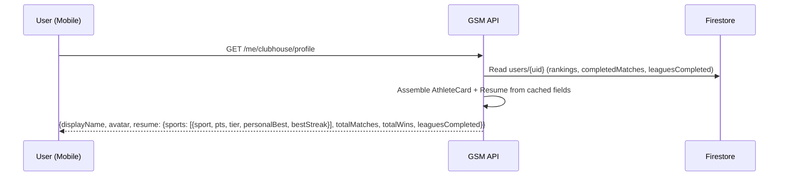

**Diagram 19: Match Confirmation with Streaks + Feed Events**

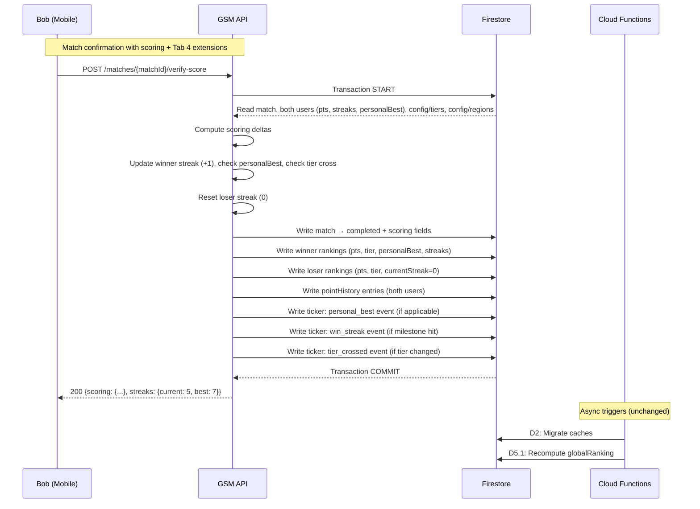

**Diagram 20: Local Pulse Feed Load**

```mermaid  
sequenceDiagram  
    participant U as User (Mobile)  
    participant API as GSM API  
    participant FS as Firestore  
    U->>API: GET /lab/ticker?region=athens&sport=tennis&types=personal_best,win_streak,tier_crossed,upset  
    API->>FS: Query ticker/{auto} where region=athens, sport=tennis, type in [...], createdAt DESC, limit 20  
    API-->>U: {events: [{type: personal_best, userName: "Dana T.", newPts: 3650, ...}, ...], nextCursor: ...}  
```

# **8\. Venue & Court Data Model  [NEW in v1.4]**

*NEW in v1.4 — Required for padel-first launch. Provides court/venue location data for broadcasts, matches, and discovery.*

## **8.1 Overview & Design Decisions**

* **Two sources, one model:** Venues come from either Google Places (autocomplete during broadcast) or a curated venues Firestore collection (manually seeded for leagues). The VenueRef value object stores enough data from either source to render a venue card and open directions.

* **No proprietary court database for MVP:** The venues collection is a thin seed list of 15–20 Athens venues. Google Places handles everything else. No booking integration.

* **Venue is optional on broadcasts:** Users selecting need_court don’t specify a venue. Users selecting have_court resolve a venue via autocomplete. The venueRef field is nullable throughout.

* **Venue propagates to match:** When an offer is accepted, the venueRef copies from the broadcast or offer onto the match document. Match history includes where the match was played.

## **8.2 Firestore Schema**

### **venues/{venueId} (New Collection)**

| Field | Type | Purpose |
| :---- | :---- | :---- |
| name | string | Venue display name |
| coordinates | GeoPoint | Latitude/longitude |
| area | string | Neighbourhood/suburb (e.g. 'Glyfada') |
| sports | array<string> | Supported sports: ['padel'], ['tennis', 'padel'], etc. |
| courtCount | number | null | Approximate number of courts |
| indoor | boolean | null | Whether courts are indoor |
| placeId | string | null | Google Place ID if known |

### **Fields Added to Existing Collections**

| Collection / Field | Type | Purpose |
| :---- | :---- | :---- |
| broadcasts/{id}.venueRef | map | null | VenueRef object (see model below) |
| offers/{id}.venueRef | map | null | VenueRef (copied from broadcast or set on direct challenge) |
| matches/{matchId}.venueRef | map | null | VenueRef (copied from broadcast/offer on match creation) |
| venueSuggestions/{auto} | Document | User-submitted venue suggestions (review queue) |

## **8.3 Pydantic Models**

### **GeoCoordinates (Value Object)**

| Field | Type | Description |
| :---- | :---- | :---- |
| lat | float | Latitude |
| lng | float | Longitude |

### **VenueRef (Value Object — embedded on broadcasts, offers, matches)**

| Field | Type | Description |
| :---- | :---- | :---- |
| venue_id | str | None | Internal Firestore doc ID (set for curated venues) |
| place_id | str | None | Google Place ID (set for Places-resolved venues) |
| name | str | Display name (always set) |
| coordinates | GeoCoordinates | {lat, lng} (always set) |

Validation: at least one of venue_id or place_id must be non-null.

## **8.4 API Endpoints Reference**

| # | Method | Path | Purpose |
| :---- | :---- | :---- | :---- |
| 1 | GET | /venues/search?q={query}&lat={lat}&lng={lng} | Proxy to Google Places Autocomplete. Returns top 5 VenueRef candidates. Merges with curated venues. |
| 2 | GET | /venues?sport={sport}&area={area} | List curated venues from seed collection. Filterable by sport and area. |
| 3 | POST | /venues/suggest | User-submitted venue suggestion. Writes to venueSuggestions for manual review. |

## **8.5 Broadcast & Match Integration**

When court_status = have_court, the mobile client presents a venue search field powered by GET /venues/search. The resolved venue is sent as venue_ref on the broadcast request. When court_status = need_court, venue_ref is null.

When an offer is accepted (creating a match), the venueRef copies from the source broadcast or offer onto the match document. This is a simple field copy in the existing match creation transaction — no additional Firestore reads.

GET /me/state payloads are extended: BroadcastActivePayload includes venueRef for the status bar. MatchScheduledPayload includes venueRef for the logistics card with directions link.

## **8.6 Sequence Diagrams (Mermaid)**

**Diagram 21: Broadcast with Venue Resolution**

```mermaid
sequenceDiagram
    participant U as User (Mobile)
    participant API as GSM API
    participant GP as Google Places API
    participant FS as Firestore
    U->>API: GET /venues/search?q=Flisvos&lat=37.93&lng=23.69
    API->>GP: Places Autocomplete (query, location bias)
    GP-->>API: [{placeId, name, coordinates}, ...]
    API-->>U: [{place_id, name, coordinates}, ...]
    U->>API: POST /me/broadcast {sport: padel, ..., venue_ref: {place_id: "ChIJ...", name: "Flisvos Padel Academy", coordinates: {lat: 37.93, lng: 23.68}}}
    API->>FS: Create broadcast with venueRef
    API-->>U: 201 {broadcastId, expiresAt}
```

# **9\. Doubles Match Support  [NEW in v1.4]**

*NEW in v1.4 — Required for padel-first launch. Padel is overwhelmingly played as doubles. This section extends the match model from 2-participant (singles) to 2-or-4-participant (singles or doubles).*

## **9.1 Overview & Design Decisions**

* **Match type enum:** Every match has a matchType field: singles (2 participants) or doubles (4 participants). Default is singles for backwards compatibility.

* **Participants array:** The match model uses a participants array of ParticipantEntry objects. Each entry includes UID, team assignment (A/B), and denormalized display name.

* **Team-based scoring:** Points are awarded to each player on the winning team individually. The formula uses cross-team point averages.

* **Cross-team confirmation:** Either player on a team can log the score. Confirmation must come from a player on the opposing team.

* **Broadcast extension:** A broadcast_type field distinguishes 'looking for opponents' from 'looking for a 4th.' A partner_uid field identifies the broadcaster's doubles partner.

## **9.2 Firestore Schema Changes**

| Collection / Field | Type | Purpose |
| :---- | :---- | :---- |
| matches/{matchId}.matchType | string | 'singles' or 'doubles'. Default: 'singles' |
| matches/{matchId}.participants | array<map> | Array of ParticipantEntry (length 2 or 4\) |
| matches/{matchId}.participants[].uid | string | Player UID |
| matches/{matchId}.participants[].team | string | null | 'A' or 'B' for doubles; null for singles |
| matches/{matchId}.participants[].displayName | string | Denormalized first + last initial |
| matches/{matchId}.resultSubmittedBy | array<string> | UIDs who submitted/confirmed result |
| broadcasts/{id}.broadcastType | string | 'find_opponent' (default) or 'find_fourth' |
| broadcasts/{id}.matchType | string | 'singles' or 'doubles' |
| broadcasts/{id}.partnerUid | string | null | Partner UID for doubles broadcast |
| offers/{id}.matchType | string | 'singles' or 'doubles' |
| offers/{id}.partnerUid | string | null | Challenger's partner UID for doubles |

## **9.3 New Enums & Models**

### **MatchTypeEnum**

class MatchTypeEnum(StrEnum):

    SINGLES = "singles"

    DOUBLES = "doubles"

### **BroadcastTypeEnum**

class BroadcastTypeEnum(StrEnum):

    FIND_OPPONENT = "find_opponent"

    FIND_FOURTH = "find_fourth"

### **ParticipantEntry (Value Object)**

| Field | Type | Description |
| :---- | :---- | :---- |
| uid | str | Player UID |
| team | str | None | 'A' or 'B' for doubles; null for singles |
| display_name | str | First name + last initial |

## **9.4 Modified Endpoints**

| # | Mtd | Path | Change |
| :---- | :---- | :---- | :---- |
| 1 | POST | /me/broadcast | Accept match_type, broadcast_type, partner_uid |
| 2 | POST | /me/offers | Accept match_type, partner_uid. Must match broadcast’s match_type. |
| 3 | POST | /me/offers/{id}/accept | Creates 4-participant match with team assignments for doubles. |
| 4 | POST | /matches/{id}/result | Doubles: accept winner_team ('A'/'B') instead of winnerUid. Any participant can submit. |
| 5 | POST | /matches/{id}/confirm | Doubles: confirmation must come from opposing team member. |
| 6 | POST | /matches/{id}/verify-score | Doubles: awards points to all 4 participants using cross-team averages. |
| 7 | GET | /me/state | All payloads include full participants array with team assignments. |

## **9.5 Scoring Engine (Doubles)**

The existing scoring formula operates on a (winner, loser) pair. For doubles, the same formula runs once per participant:

**For each winner:** calculatePointDelta(winner.pts, avg(loser_team_pts)) where avg(loser_team_pts) is the mean of the two losing players’ current points.

**For each loser:** calculateLossPenalty(loser.pts, avg(winner_team_pts)) using winner average.

Personal bests, streaks, and tier transitions are evaluated per player individually. Ticker events (upsets, personal bests, streaks) fire per player as usual.

Transaction impact: singles ≈ 10 Firestore writes. Doubles ≈ 18 writes (4 point updates + 4 pointHistory + 4 streak/PB + up to 4 ticker + match doc + cache updates). Still well within Firestore’s 500-write limit.

## **9.6 State Machine Impact**

The 9-state state machine is unchanged. Doubles matches progress through the same states as singles. The payloads contain more participants and the confirmation logic requires cross-team verification.

Key rule: in MATCH_SCHEDULED through post-match states, the state applies to each individual player. If Alice and Bob are Team A and Charlie and Diana are Team B, all four players independently transition through the same state machine.

## **9.7 Sequence Diagrams (Mermaid)**

**Diagram 22: Doubles Match — Broadcast → Challenge → Score**

```mermaid
sequenceDiagram
    participant A as Alice (Mobile)
    participant API as GSM API
    participant FS as Firestore
    participant C as Charlie (Mobile)
    Note over A,C: Phase 1 — Doubles Broadcast
    A->>API: POST /me/broadcast {sport: padel, match_type: doubles, partner_uid: bob, broadcast_type: find_opponent, venue_ref: {...}}
    API->>FS: Create broadcast (matchType: doubles, partnerUid: bob)
    API-->>A: 201 {broadcastId}
    Note over A,C: Phase 2 — Doubles Challenge
    C->>API: POST /me/offers {to_uid: alice, match_type: doubles, partner_uid: diana}
    API-->>C: 201 {offerId}
    A->>API: POST /me/offers/{id}/accept
    API->>FS: Transaction: create match [{alice,A},{bob,A},{charlie,B},{diana,B}]
    API-->>A: 200 {matchId}
    Note over A,C: All 4 players → MATCH_SCHEDULED
    Note over A,C: Phase 3 — Score Logging
    A->>API: POST /matches/{id}/result {score: [...], winner_team: A}
    API-->>A: POST_MATCH_WAITING_OPPONENT
    C->>API: POST /matches/{id}/confirm
    API->>FS: Transaction: score all 4, update streaks/PB, write ticker events
    Note over A,C: All 4 → DISCOVERY, rankings updated
```

# **10\. Cross-Tab Integration**

*Updated in v1.3 with Tab 4 data flows.*

All four tabs are deeply interconnected through data feedback loops that turn simple match logs into competitive intelligence and social engagement:

### **Tab 1 → Tab 2: Match Completion Triggers Journal**

When a match is finalised in Tab 1, the D2 trigger migrates it into the completedMatches cache. The mobile app can then prompt the user to “Log Match” in Tab 2, pre-populating the journal entry with opponent, score, and result.

### **Tab 2 → Tab 1: Reflection Feeds Scouting**

Every MatchReflection saved in Tab 2 maps opponent weakness/strength tags to the opponent’s UID. When a user enters MATCH_SCHEDULED state in Tab 1, the scouting section aggregates community reflection data about that opponent.

### **Tab 1 → Tab 3: Match Confirmation Feeds Scoring**

*[NEW in v1.2]*

When POST /matches/{matchId}/verify-score completes, the inline scoring engine writes updated points and pointHistory entries. These feed the Progression Graph and tier placement in Tab 3\. Async triggers (D5) update global rankings and leaderboard source data.

### **Tab 2 → Tab 3: Reflections Feed Skill DNA & Scouting**

*[NEW in v1.2]*

Journal reflections written in Tab 2 trigger D4, which maps skill tags to radar axes and updates the user’s Skill DNA (Tab 3 radar chart). Opponent-focused tags also increment counters on scouting/{opponentUid}, building community scouting profiles visible in Tab 3\.

### **Tab 3 → Tab 1: Scouting Report in MATCH_SCHEDULED**

*[NEW in v1.2]*

When a user is in MATCH_SCHEDULED state on Tab 1, the scouting section pulls data from scouting/{opponentUid} to display community intelligence and from the rivalry endpoint for H2H stats and win probability.

### **Tab 1 → Tab 4: Match Confirmation Feeds Streaks & Activity**

*[NEW in v1.3]*

The match confirmation transaction (POST /matches/{matchId}/verify-score) now also updates personalBest, currentStreak, and bestStreak on both participants’ user docs. When milestone conditions are met (personal best exceeded, streak threshold hit, tier boundary crossed), ticker events are written inline for the Local Pulse feed on Tab 4\.

### **Tab 3 → Tab 4: Shared Ticker Collection**

*[NEW in v1.3]*

Tab 3 and Tab 4 share the ticker/{auto} collection. Tab 3 reads upset events for the Lab’s upsets ticker; Tab 4 reads all event types (upsets + personal_best + win_streak + tier_crossed) for the Local Pulse feed. The types query parameter on the ticker endpoint enables this filtering.

### **Tab 4 → External: Social Sharing**

*[NEW in v1.3]*

### **Tab 1 → Venues: Broadcast Location Resolution  [NEW in v1.4]**

When a user broadcasts with have_court, they resolve a venue via Google Places autocomplete or the curated seed list. The venueRef propagates through the offer and onto the match document, creating a location history for every match played through GSM.

### **Doubles → Scoring Engine: Team-Based Point Awards  [NEW in v1.4]**

The scoring engine’s inline calculation (triggered during POST /matches/{matchId}/verify-score) now handles both singles (2 participants) and doubles (4 participants). For doubles, point deltas use cross-team averages. Streaks, personal bests, and ticker events evaluate per-player individually. A doubles match can generate up to 4× the ticker events of a singles match.

The Athlete Card and Athlete Resume can be shared externally via the native iOS share sheet. Share card images are rendered client-side from cached data (no backend image generation for MVP).

**Diagram 17: Full Cross-Tab Data Flow (updated for v1.3)**

```mermaid  
sequenceDiagram  
    participant T1 as Tab 1: PLAY  
    participant API as GSM API  
    participant FS as Firestore  
    participant CF as Cloud Functions  
    participant T2 as Tab 2: IMPROVE  
    participant T3 as Tab 3: THE LAB  
    participant T4 as Tab 4: CLUBHOUSE  
    Note over T1,T4: Match completion → scoring → streaks → feed events  
    T1->>API: POST /matches/{id}/verify-score  
    API->>FS: Transaction: match completed + scoring + pointHistory + streaks + ticker events  
    CF->>FS: D2: migrate caches | D5.1: update rankings  
    T2->>API: POST /me/journal {entry_type: match, match_id: m_789}  
    T2->>API: PATCH /me/journal/{id} {reflection: {opponentWeak: [backhand]}}  
    Note over CF: D4 trigger fires  
    CF->>FS: D4.2: Update user skillDna  
    CF->>FS: D4.3: Update scouting/{opponentUid}  
    Note over T3: User opens The Lab  
    T3->>API: GET /me/lab/dashboard  
    API-->>T3: {pts: 2300, tier: intermediate, rank: 142}  
    Note over T4: User opens Clubhouse  
    T4->>API: GET /me/clubhouse/profile  
    API-->>T4: {tier: intermediate, pts: 2300, personalBest: 2300, bestStreak: 5}  
    T4->>API: GET /lab/ticker?region=athens&sport=tennis&types=all  
    API-->>T4: [{type: personal_best, ...}, {type: win_streak, ...}]  
    Note over T1: Future match → scouting enrichment  
    T1->>API: GET /me/state → MATCH_SCHEDULED  
    API->>FS: Read scouting/{opponentUid}  
    API-->>T1: Scouting: "Weak backhand (7 players tagged)"  
```

# **11\. Appendix: Diagram Index**

All diagrams use Mermaid syntax. Render in GitHub, Notion, VS Code, or https://mermaid.live

| # | Diagram | Section |
| :---- | :---- | :---- |
| A1 | Authentication & Authorization Flow | 2.5 — Authentication |
| 1 | Full Broadcast → Match → Score Flow | 3.5 — Tab 1 Sequences |
| 2 | Direct Challenge (No Broadcast) | 3.5 — Tab 1 Sequences |
| 3 | Offer Expiry & Broadcast Cancellation | 3.5 — Tab 1 Sequences |
| 4 | Score Dispute Flow | 3.5 — Tab 1 Sequences |
| 5 | Match Journal Entry & Reflection | 4.4 — Tab 2 Sequences |
| 6 | Training Session Log | 4.4 — Tab 2 Sequences |
| 7 | North Star Goal & Dashboard | 4.4 — Tab 2 Sequences |
| 8 | Journal Browsing & Pagination | 4.4 — Tab 2 Sequences |
| 9 | onMatchWrite Trigger Flow (updated) | 5.9 — Trigger Flows |
| 10 | onLeagueMemberWrite Trigger Flow | 5.9 — Trigger Flows |
| 10b | onJournalWrite Trigger Flow (NEW) | 5.9 — Trigger Flows |
| 11 | Match Lifecycle End-to-End (updated) | 5.9 — Trigger Flows |
| 13 | Match Confirmation with Inline Scoring (NEW) | 6.9 — Tab 3 Sequences |
| 14 | Skill DNA Aggregation Flow (NEW) | 6.9 — Tab 3 Sequences |
| 15 | Rivalry Scout Head-to-Head (NEW) | 6.9 — Tab 3 Sequences |
| 16 | Leaderboard Read + Computation (NEW) | 6.9 — Tab 3 Sequences |
| **17** | **Full Cross-Tab Data Flow (updated v1.3)** | **8 — Cross-Tab Integration** |
| **18** | **Athlete Card Profile Load (NEW v1.3)** | **7.9 — Tab 4 Sequences** |
| **19** | **Match Confirmation with Streaks + Feed Events (NEW v1.3)** | **7.9 — Tab 4 Sequences** |
| **20** | **Local Pulse Feed Load (NEW v1.3)** | **7.9 — Tab 4 Sequences** |
| **21** | Broadcast with Venue Resolution (NEW v1.4) | 10.6 — Venue Sequences |
| **22** | Doubles Match Lifecycle (NEW v1.4) | 11.7 — Doubles Sequences |